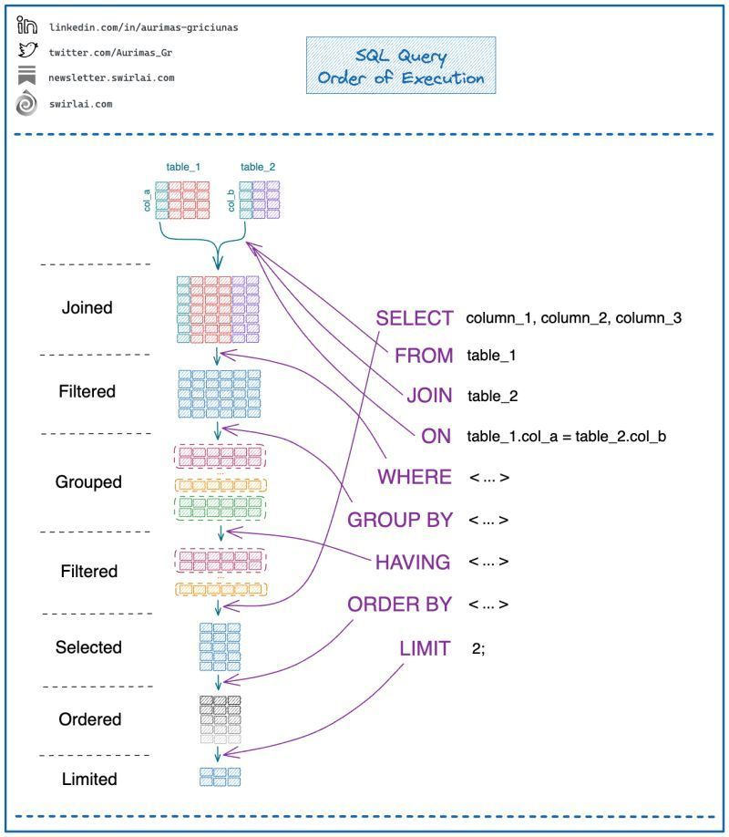

# SQL-запросы

## Записи в таблице

```sgl
SELECT * FROM products WHERE ID=2                                   /* выбор 1 записи */
SELECT * FROM products ORDER BY ID                                  /* выбор всех записей */
SELECT * FROM products WHERE NAME LIKE '%название%'                 /* выборка по неполному названию, регистр не учитывается */
SELECT MAX(ID) AS ID FROM products                                  /* получение последнего id */
INSERT INTO products(NAME, DESCRIPTION) VALUES ('Имя', 'Описание')  /* добавление новой записи */
UPDATE products SET NAME='Имя', DESCRIPTION='Описание' WHERE ID=2   /* редактирование записи */
DELETE FROM products WHERE ID=2                                     /* удаление записи */
```

```sgl
ORDER BY id DESC /* сортировка в обратном порядке */
ORDER BY id ASC  /* сортировка в алфавитном порядке */
ORDER BY RAND()  /* рандомный порядок */
LIMIT 10         /* последние 10 записей */
LIMIT 5, 10      /* с 6 по 15 записи (5 начальное значение, 10 кол-во элементов) */
```

<!--  -->

### Пример #1. Выборка товара с максимальной ценой

```sgl
SELECT *
FROM products
WHERE PRICE=(SELECT MAX(PRICE) AS PRICE FROM products)
```

### Пример #2. Диапазон in

```sgl
SELECT *
FROM products
WHERE NAME in ("Name1", "Name2")
```

## Таблицы в БД

```sgl
DROP TABLE users             /* удаление таблицы */
RENAME TABLE DOORS TO DOOR   /* изменение имени таблицы */
```
