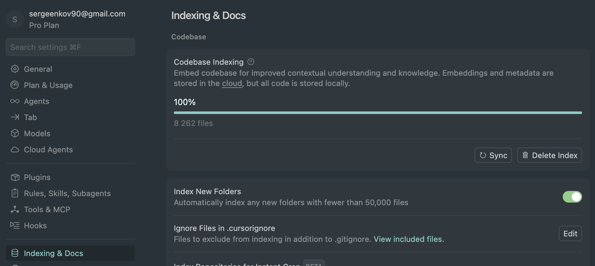

# Настройки

## Agent Settings

### Индексирование репозитория

<v-breadcrumbs keys :items="['Agent Settings', 'Indexing & Docs', 'Codebase Indexing', 'Compute Index']" />

- После индексирования будет указано 100%

