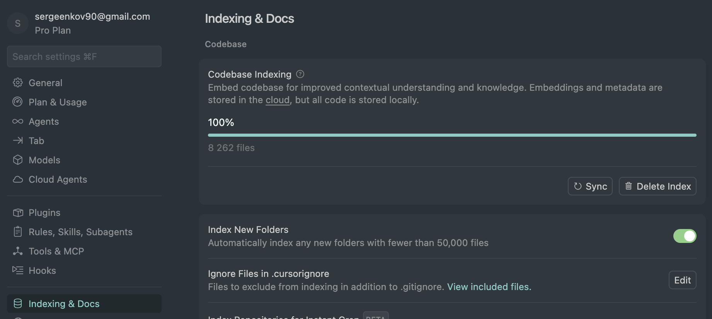

# Настройки

## Cursor Settings

<v-breadcrumbs :items="['Cursor', 'Preferences', 'Cursor Settings']" />

::: details Автокомплит текста в редакторе
<v-breadcrumbs :items="['Tab', 'Cursor Tab']" />
:::

::: details Открыть ссылки Localhost из Терминала в Браузере

- Клик из Терминала по-умолчанию открывает браузер Cursor. Нужно, чтобы открывал внешний браузер

<v-breadcrumbs :items="['Tools & MCPs', 'Browser', 'Show Localhost Links in Browser']" />

:::

::: details Индексирование репозитория

<v-breadcrumbs :items="['Indexing & Docs', 'Indexing & Docs', 'Codebase Indexing', 'Compute Index']" />

- После индексирования будет указано 100%

:::

::: details Правила для работы агентов
<v-breadcrumbs :items="['Rules, Skills, Subagents', 'Rules']" />
:::
