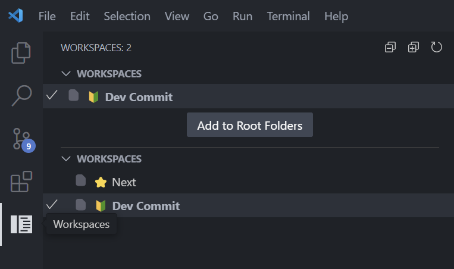

# Несколько Workspaces

## VSCode Extensions

::: info

- https://marketplace.visualstudio.com/items?itemName=tomsaunders-code.workspace-explorer - Workspace Explorer (не проверял)
- https://marketplace.visualstudio.com/search?term=workspace&target=VSCode&category=All%20categories&sortBy=Relevance - Поиск по расширениям
  :::

## VSCode расширение Workspace Sidebar

### 1. Сохранить Workspase

- Открыть рабочее Workspase в VSCode
- Сохранить Workspases в отдельный файл: <v-breadcrumbs :items="['File', 'Save Workspace as...']" />
- У меня путь "D:\Workspaces"

#### Структура файла

> workspaceName.code-workspace

```js
{
  "folders": [
    {
      "name": "Name Workspace 1",
      "path": "C:/Users/UserName/Desktop/Repo/repo1"
    },
    {
      "name": "Name Workspace 2",
      "path": "C:/Users/UserName/Desktop/Repo/repo2"
    },
  ]
}
```

::: details Настройка colorCustomizations

> workspaceName.code-workspace

```js
{
  "folders": [
    //
  ],
  "settings": {
    "workbench.colorCustomizations": {
      // Activity Bar
      "activityBar.activeBackground": "#65c89b",
      "activityBar.background": "#65c89b",
      "activityBar.foreground": "#15202b",
      "activityBar.inactiveForeground": "#15202b99",

      // Activity Bar Badge
      "activityBarBadge.background": "#945bc4",
      "activityBarBadge.foreground": "#e7e7e7",

      // Status Bar
      "statusBar.background": "#42b883",
      "statusBar.foreground": "#15202b",
      "statusBarItem.hoverBackground": "#359268",
      "statusBarItem.remoteBackground": "#42b883",
      "statusBarItem.remoteForeground": "#15202b",

      // Title Bar
      "titleBar.activeBackground": "#42b883",
      "titleBar.activeForeground": "#15202b",
      "titleBar.inactiveBackground": "#42b88399",
      "titleBar.inactiveForeground": "#15202b99"

      // Common
      "commandCenter.border": "#15202b99",
      "sash.hoverBorder": "#65c89b",
    },
    "peacock.color": "#42b883"
  }
}
```

:::

### 2. Установить расширение Workspace Sidebar

::: info

- https://marketplace.visualstudio.com/items?itemName=sketchbuch.vsc-workspace-sidebar - Workspace Sidebar
  :::

### 3. Конфигурация

- Отукрыть файл конфига и указать путь к сохраненным Workspaces

> C:\Users\UserName\AppData\Roaming\Code\User\settings.json

```json
{
  "workspaceSidebar.rootFolders": [
    {
      "path": "D:\\Workspaces",
      "excludeHiddenFolders": true
    }
  ]
}
```

### 4. Настройка иконок

::: info

- https://github.com/sketchbuch/vsc-workspace-sidebar - GitHub
- https://github.com/sketchbuch/vsc-workspace-sidebar/blob/master/docs/File%20Icon%20Themes.md - GitHub. File Icon Themes
  :::

**Значения**

- `dart`, `java`, `md`, `yaml`
- `javascript`, `typescript`
- `tsx`, `jsx`

**Пример названия**

- Name.yaml.code-workspace
- Name.vue.code-workspace

### 5. Интерфейс

- В VSCode появится вкладка "Workspaces"


