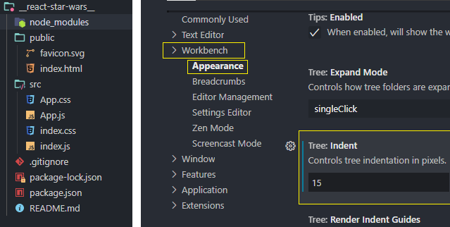
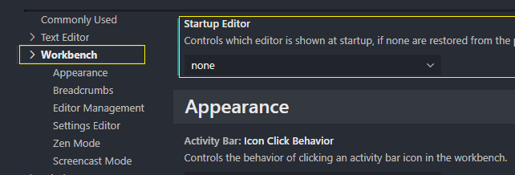
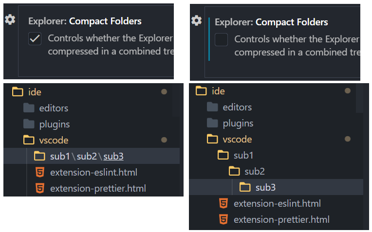
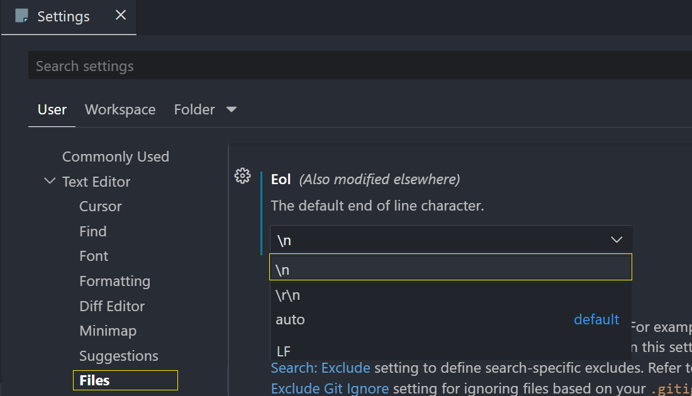

# Настройки редактора

## Color Theme

- _Color Theme_: One Dark Pro
- _File Icon Theme_: Material Theme Icons Palenight / Material Icon Theme

## Settings

### Text Editor

<v-breadcrumbs :items="['Settings', 'Text Editor']" />

- _Tab Size_: 2
- _Word Wrap_: on

### Tree: Ident



### Startup Editor



### Explorer: Compact Folders

- По-умолчанию вложенные пустые директории отображаются в одну линию. Отключается флагом _Compact Folders_ или настройкой `"explorer.compactFolders": false`



### Смена CRLF на LF

::: tip Определения

- **LF** и **CRLF** - стандартные завершающие символы
- LF - символ перевода строки на платформах Linux
- CRLF - символы возврата каретки и перевода строки на платформах Windows

  :::

> В мир компьютеров эти управляющие коды пришли из мира печатных машинок
>
> - «CR» сокращение от «Carriage Return» (возврат каретки)
> - «LF» сокращение от «Line Feed» (подача бумаги на следующую строку)

- При создании нового файла он будет в формате **LF**



- Можно создать файл _settings.json_ и там изменить настройки

```js
{
  "files.eol": "\n",
}
```

## Внешний вид

<v-breadcrumbs :items="['View', 'Appearance']" />

- _Minimap_ (убрать флаг)
- _Breadcrumbs_ (убрать флаг)
- _Render Whitespace_ (убрать флаг)
- _Sticky Scroll_ (убрать флаг)
