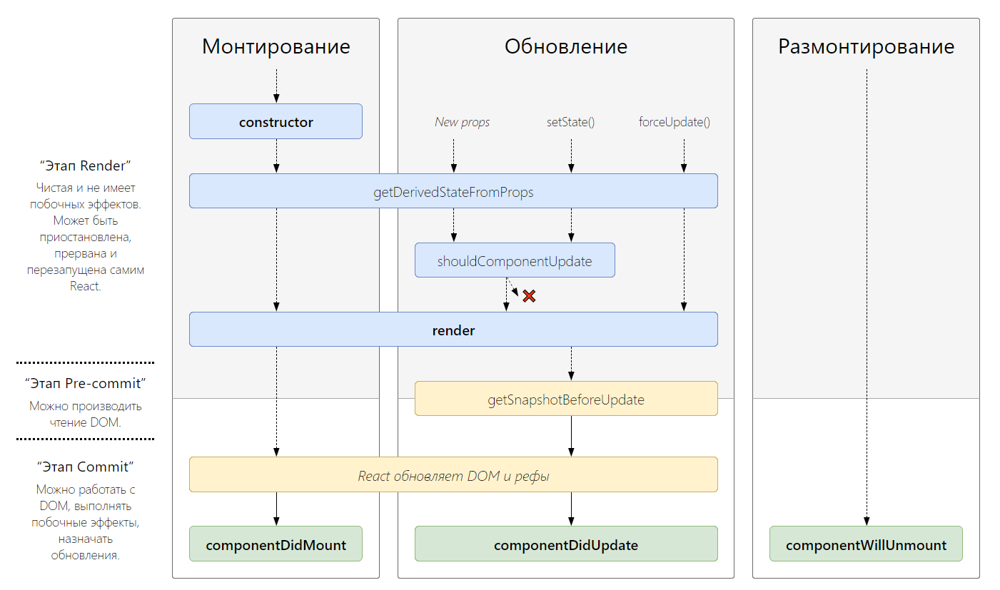

# Жизненный цикл React-компонентов

::: info
http://projects.wojtekmaj.pl/react-lifecycle-methods-diagram/
:::

<!--  -->

- **Lifecycle Methods** - Методы жизненного цикла
- **Lifecycle Hooks** - Функции, вызываемые на каждом этапе жизненного цикла

## Server Side Rendering

- У React 2 рендеринга: клиентский и серверный

- Метод render() был заменен на hydrate()

```js
hydrate(<App/>, document.getElementById("root"));
```
- componentDidMount() не используется
- При SSR не нужно обновление компонента
