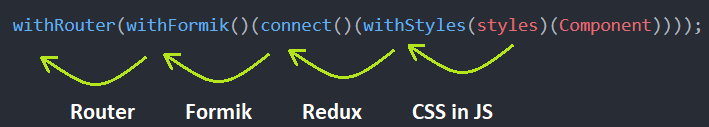

# Компоненты высшего порядка

### Теория

- **Компонент высшего порядка** (Higher-Order Component, HOC) - функция, расширяющая функционал компонента без изменение его исходного кода
- Основано на принципе "Композиция"
- HOC не наследует поведение оборачиваемого компонента
- HOC является чистой функцией без побочных эффектов
- Это один из продвинутых способов для повторного использования логики. HOC не являются частью API React, но часто применяются из-за композиционной природы компонентов
- HOC часто встречаются в сторонних библиотеках, например connect в Redux и createFragmentContainer в Relay
- Если обычный компонент преобразует пропсы в UI, то компонент высшего порядка преобразует компонент в другой компонент

### Действия

1. Принимает оборачиваемый компонент (оборачивает оригинальный компонент в контейнер посредством композиции)
2. Через пропсы передает ему новые данные
3. Возвращает новый компонент с расширенной логикой

### Применение

- Переиспользование логики
- Есть 2 или несколько компонентов, логика которых совпадает. Чтобы не дублировать логику, можно использовать HOC
- Применение: данные для аналитики

### Предостережения

- Не используйте HOC внутри рендер-метода. Происходит повторное монтирование компонента обнуляет его состояние, а также состояние его дочерних компонентов
- Копируйте статические методы
- Рефы не передаются. По соглашению компоненты высшего порядка передают оборачиваемому компоненту все пропсы, кроме рефов. ref на самом деле не проп, как, например, key, и поэтому иначе обрабатывается React. Реф элемента, созданного компонентом из HOC, будет указывать на экземпляр ближайшего в иерархии контейнера, а не на оборачиваемый компонент

### Основано на паттерне "return function"

```js
const func = (a) => {
	return (b) => {
		console.log(a + b); // 3
	}
}

func(1)(2);
```

<!--  -->

## Отличие "Higher-Order Component" от паттрена "Декоратор"

- После добавления декоратора свойство/класс можно использовать только в его оформленной форме. HOC шаблон оставляет более высокий порядок, а также компоненты более низкого порядка, доступные для использования.
- Дектораторы используются для мутации переменной в то время как HOC рекомендуется не делать
- HOC должны отображать компонент, в то время как декораторы могут возвращать разные вещи в зависимости от реализации

## Примеры

### 1. Минимальный пример на хуках

- withErrorApi пробрасывает проп setErrorApi в компонент

HOC

```js
import { useState } from 'react';

export const withErrorApi = View => {
    return props => {
        const [errorApi, setErrorApi] = useState(false);

        return (
            errorApi
                ? <h1>Error</h1>
                : <View setErrorApi={setErrorApi} {...props} />
        )
    }
}
```

Использование HOC

```js
import { withErrorApi } from '@hoc-helpers/withErrorApi';

const App = ({ setErrorApi }) => {
    // отправляем сетевой запрос и если ответ "res" вернёт false
    // то отображается ошибка
    setErrorApi(res);
    return (...)
}

export default withErrorApi(App);
```

### 2. Минимальный пример на классах

- withData - функция, возвращающая компонент, оборачивающий основной компонент
- withData может содержать дополнительную логику
- withData - пустой компонент-обертка, который вызывает компонент App и передает все свойства, которые он получил сам
- App - отвечает за отображение. withData - отвечает за логику, можно вынести в отдельный файл и переиспользовать

```js
// Оборачиваемый компонент
class App extends Component {
    render() {
      return <h1>Hello</h1>
    }
}

// Higher-Order Component
const withData = (Wrapped) => {
    return class extends Component {
        render() {
            return <Wrapped {...this.props} />
        } 
    }
}

// Компонент, обернутый в HOC
const EnhancedComponent = withData(App);

// Компонент, обернутый в HOC (на экспорт)
export default withData(App);
```

### 3. Counter

::: info
https://www.youtube.com/watch?v=B6aNv8nkUSw&list=PLC3y8-rFHvwgg3vaYJgHGnModB54rxOk3&index=34
:::

```js
import React, { Component } from 'react';

export default class App extends Component {
	render() {
		return (
			<div>
				<EnhancedComponent name="Tony" />
			</div>
		);
	}
}
```

```js
class WrappedComponent extends Component {
	render() {
		return (
			<div>
				{this.props.count}
				{this.props.name}
				<button onClick={this.props.increment}>Ok</button>
			</div>
		);
	}	
}
```

```js
const higherOrderComponent = (WrappedComponent, incrementNumber) => {
	return class extends Component {
		constructor(props) {
			super(props);
			this.state = {
				count: 0
			};
		}
		increment = () => {
			this.setState(state => ({
				count: state.count + incrementNumber
			}));
		}
		render() {
			//console.log(this.props.name);
			return (
				<WrappedComponent 
					count={this.state.count} 
					increment={this.increment} 
					{ ...this.props }
				/>
			);
		}		
	}
}
```

```js
const EnhancedComponent = higherOrderComponent(WrappedComponent, 5);
```

### 4. withStyles из Material-UI

```js
import React from 'react';
import { withStyles } from '@material-ui/core/styles';
import styles from './ComponentStyles';

const Component = ({ classes }) => {
	return (
		<h1 className={classes.header}>Desktop</h1>
	);
};

export default withStyles(styles)(Component);
```

```js
const ComponentStyles = ({ spacing }: Object) => ({
	header: {}
});

export default ComponentStyles;
```

### 5. connect из Redux

```js
import { connect } from 'react-redux';

const mapStateToProps = state => ({
	myValue: state.myReducer
})
const mapDispatchToProps = {
	getMethod: getMethod
}
export default connect(
	mapStateToProps,
	mapDispatchToProps
)(Component);
```
