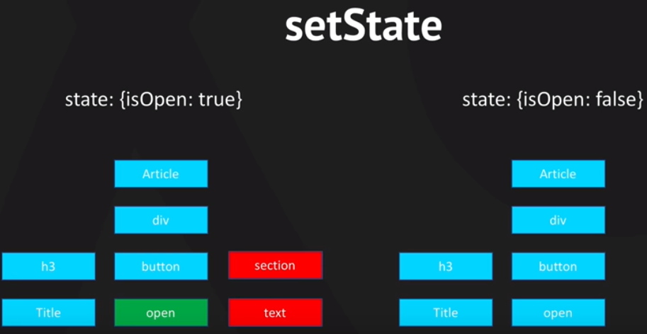

# Virtual DOM (React)

- React создает легковесное дерево из JavaScript-объектов для имитации DOM-дерева. Затем он создает из них HTML, который вставляется или добавляется к нужному DOM-элементу, что вызывает перерисовку страницы в браузере
- JS объекты просто строить и сравнивать

## Алгоритм

1. Происходит рендер React приложения
2. Дерево элементов, которое описывает приложение, генерируется в зарезервированной памяти
3. Это дерево потом включается в рендеринг окружение - на примере браузерного приложения, оно переводится в набор DOM операций
4. Когда состояние приложения обновляется (обычно вызовом setState), новое дерево генерируется
5. Новое дерево сравнивается с предыдущим, чтоб просчитать и включить именно те операции, которые нужны для перерисовки обновленного приложения

### 1. Первоначальный Render DOM

1. Вернули JSX

```js
class App extends React.Component {
  render(
    return (
      <div>Hello</div>
    )
  );
}
```

2. Транспиляция в React.createElement (Virtual DOM)

```js
React.createElement('div', null, 'Hello'),
```

3. Рендер в браузер DOM (react-dom)

```js
ReactDOM.render(<App />, document.getElementById("root"));
```

### 2. Изменение setState()

- При нажатии `setState()` каждый раз асинхронно (React 16) перестраивается Virtual DOM для компонента и всех его потомков. Но в DOM идут только изменения

1. Произошел setState() в компоненте App. Помечаем компонент как "грязный"
2. Перестроение Virtual DOM
3. Сравнение измененного Virtual DOM и старого Virtual DOM. При нахождении изменений, меняется компонент в реальном DOM


