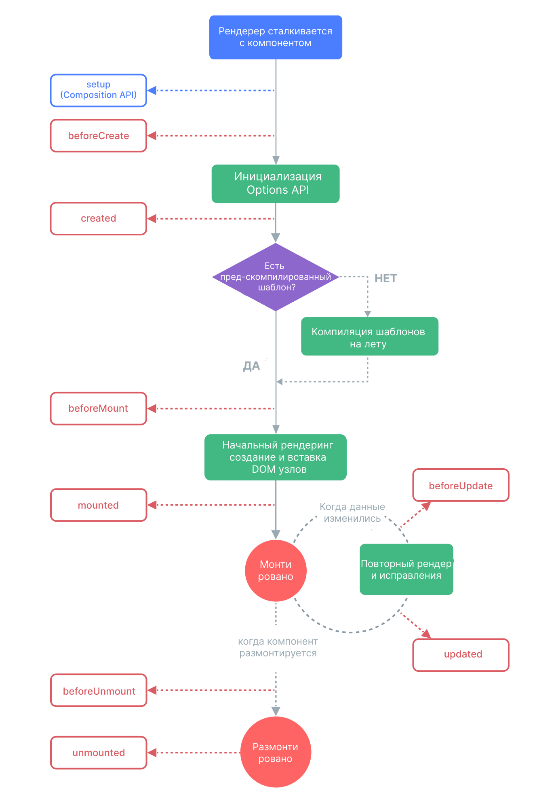

# Жизненный цикл компонента

## Информация

::: details Схема жизненного цикла компонентов

:::

## Методы

### Основные

::: details `onMounted()`

> Регистрирует callback, который будет вызываться после монтирования компонента

```vue
<script setup lang="ts">
import { onMounted } from "vue";

onMounted(() => {
  //
});
</script>
```

:::

::: details `onUpdated()`

> Регистрирует callback, который будет вызываться после того, как компонент обновит свое дерево DOM из-за реактивного изменения состояния

```vue
<script setup lang="ts">
import { ref, onUpdated } from "vue";

const count = ref(0);

const increment = () => {
  count.value++;
};

onUpdated(() => {
  console.log(count.value);
});
</script>

<template>
  <button @click="increment">Increment</button>
</template>
```

:::

::: details `onUnmounted()`

> Регистрирует callback, который будет вызываться после размонтирования компонента

```vue
<script setup lang="ts">
import { onUnmounted } from "vue";

onUnmounted(() => {
  //
});
</script>
```

:::

### Before

- `onBeforeMount()` - регистрирует хук, который будет вызываться непосредственно перед монтированием компонента
- `onBeforeUpdate()` - регистрирует хук, который будет вызываться непосредственно перед тем, как компонент собирается обновить свое дерево DOM из-за реактивного изменения состояния
- `onBeforeUnmount()` - регистрирует хук, который будет вызываться непосредственно перед размонтированием экземпляра компонента

### Длополнительно

- `onErrorCaptured()` - Регистрирует хук, который будет вызываться при перехвате ошибки, распространяющейся от компонента-потомка
- `onRenderTracked()` - _DEV ONLY_. Регистрирует хук отладки, который будет вызываться, когда реактивная зависимость отслеживается Render Effect компонента
- `onRenderTriggered()` - _DEV ONLY_. Регистрирует перехватчик отладки, который будет вызываться, когда реактивная зависимость запускает повторный запуск Render Effect компонента
- `onActivated()` - Регистрирует callback, который будет вызываться после того, как экземпляр компонента будет вставлен в DOM как часть дерева, кэшированного `<KeepAlive>`
- `onDeactivated()` - Регистрирует callback, который будет вызываться после удаления экземпляра компонента из DOM как части дерева, кэшированного lt;KeepAlive>
- `onServerPrefetch()` - _SSR ONLY_. Регистрирует асинхронную функцию, которая должна быть разрешена до того, как экземпляр компонента будет отрисован на сервере
