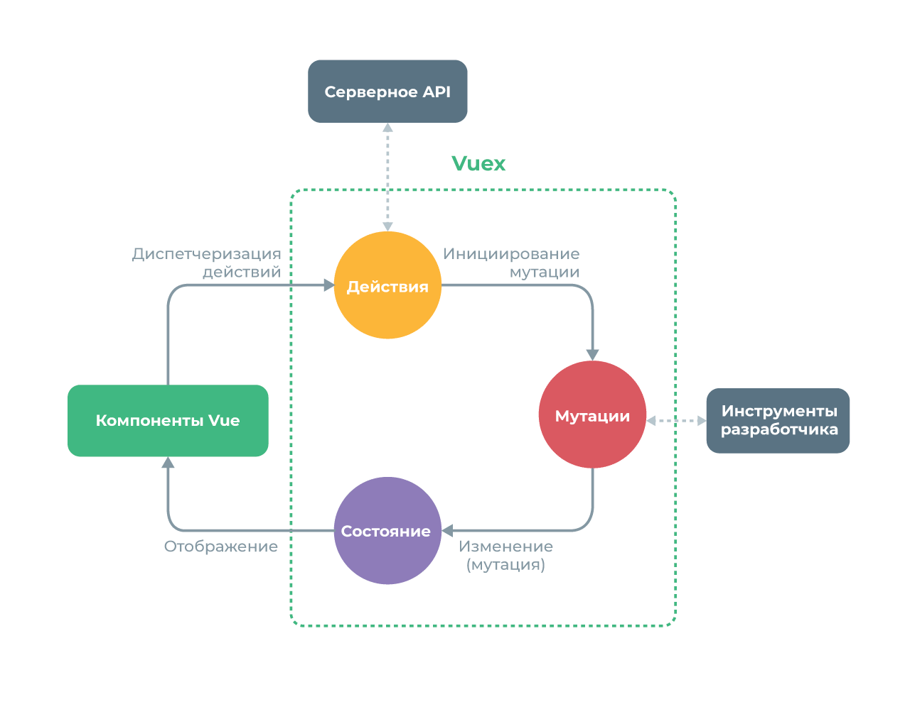

# Описание

::: tip Vuex

- **Vuex** - паттерн управления состоянием + библиотека для приложений на Vue.js. Он служит централизованным хранилищем данных для всех компонентов приложения с правилами, гарантирующими, что состояние может быть изменено только предсказуемым образом
  :::

- Vuex интегрируется с официальным расширением vue-devtools, предоставляя «из коробки» такие продвинутые возможности, как «машину времени» для отладки и экспорт/импорт слепков состояния данных
- Идея: вынести всё общее состояние приложения из компонентов и управлять им в глобальном синглтоне. При этом наше дерево компонентов становится одним большим «представлением» и любой компонент может получить доступ к состоянию приложения или вызывать действия для изменения состояния, независимо от того, где они находятся в дереве
- Постоено на основе _Flux_

