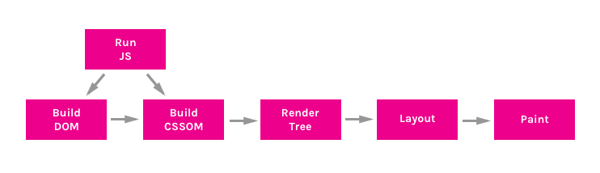
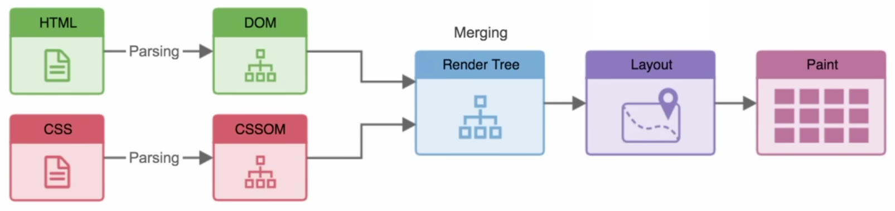

# Critical Rendering Path

## Critical Rendering Path

- **Critical Rendering Path** (Критический путь рендеринга) - последовательность шагов, необходимая для первого отображения страницы (прежде чем HTML-ответ от сервера будет преобразован в пиксели на экране)
- Знания о CRP необходимы для улчшения производительности

## Данные

- Style Calculation - вычисление стилей для каждого элемента
- Render 16ms

## Изображения

<!--  -->

---

<!--  -->

## Алгоритм

### 1. Построение DOM-дерева ✅

- Из полученного от сервера HTML-документа формируется DOM
- **DOM** (объектная модель документа) дерево это объект, представляющий полностью разобранную HTML-страницу. Начиная с корневого элемента html, узлы создаются для каждого элемента/текста на странице. Элементы, вложенные в другие элементы, представлены в виде дочерних узлов, и каждый узел содержит полный набор атрибутов для этого элемента
- HTML может быть исполнен по частям. Документ не должен быть загружен полностью для того, чтобы контент начал появляться на странице
- DOM-дерево помещается в JavaScript-объект Document

---

### 2. Построение CSSOM-дерева ❌

- Загружаются и распознаются стили, формируется CSSOM
- Строится параллельно с построением DOM
- **CSSOM** (CSS Object Model) - объект, представляющий стили, связанные с DOM. Он выглядит так же как DOM, но с соответствующими стилями для каждого узла. Не имеет значения были ли стили объявлены явно или наследуются
- CSS считается «блокирующим обработку ресурсом». Это значит, что Render-дерево не может быть построено без полного первоначального разбора CSS
- В отличии от HTML, CSS не может быть использован по частям в силу своей каскадной природы. Стили, описанные в документе ниже, могут переопределять и изменять стили, определённые ранее. Так что если мы начнём использовать CSS-стили до того, как будет разобрана таблица стилей, мы можем столкнуться с ситуацией, когда стили будут применяться неверно. Это означает, что для перехода к следующему шагу, необходимо полностью разобрать CSS

CSSOM перестраивается полностью каждый раз---

### 3. Запуск JavaScript ❌ при async ✅

- JavaScript является блокирующим ресурсом для парсера. Это означает, что JavaScript блокирует разбор самого HTML-документа
- Когда парсер доходит до тега script (не важно внутренний он или внешний), он останавливается, забирает файл (если он внешний) и запускает его
- JavaScript можно загружать асинхронно, указав атрибут async, для того, чтобы избежать блокировки парсера

---

### 4. Создание Render Tree

- **Render-дерево** - совокупность DOM и CSSOM
- Это дерево, которое даёт представление о том, что в конечном итоге будет отображено на странице. Это означает, что оно захватывает только видимый контент и не включает, например, элементы, которые были скрыты с помощью CSS-правила display: none или &lt;head&gt;

---

### 5. Layout (генерация раскладки)

- **Раскладка** - для каждого элемента Render Tree определяютяс его размеры и рассчитывается его положение на странице
- Вычисление взаимного расположения и размеров элементов на странице, плюс компоновка всего
- Браузеры используют поточный метод (flow), при котором в большинстве случаев достаточно одного прохода для размещения всех элементов (для таблиц проходов требуется больше)
- Определяется размер видимой области документа (viewport), которая обеспечивает контекст для стилей CSS, зависимых от него, например, проценты или единицы viewport
- Размер viewport определяется метатэгом, находящемся в head документа или, если тэг не представлен, будет использовано стандартное значение viewport 980px

---

### 6. Paint (отрисовка в браузере)

- **Отрисовка** - видимый контент страницы преобразуется в пиксели и отрисовывается на экране
- Время, которое займет этот этап, зависит как от величины DOM, так и от того, какие стили применяются. Некоторые стили требуют больше усилий, чтобы быть применёнными, чем другие. Например, сложное градиентное фоновое изображение потребует больше времени, чем простой сплошной цвет на фоне

## Chrome Dev Tools

- Chrome Dev Tools ➝ Performance ➝ Event Log
- Chrome Dev Tools ➝ Network ➝ Record network activity

1. Send Request - GET-запрос, отправленный для index.html
2. Parse HTML and Send Request - начать разбор HTML и построение DOM. Отправить GET запрос для style.css и main.js
3. Parse Stylesheet - CSSOM, созданный для style.css
4. Evaluate Script - вычислить (выполнить) main.js
5. Layout - генерация раскладки, основанной на значении метатега viewport
6. Paint - отрисовка пикселей в документе
