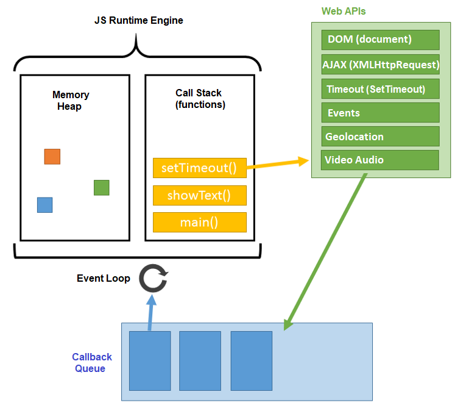
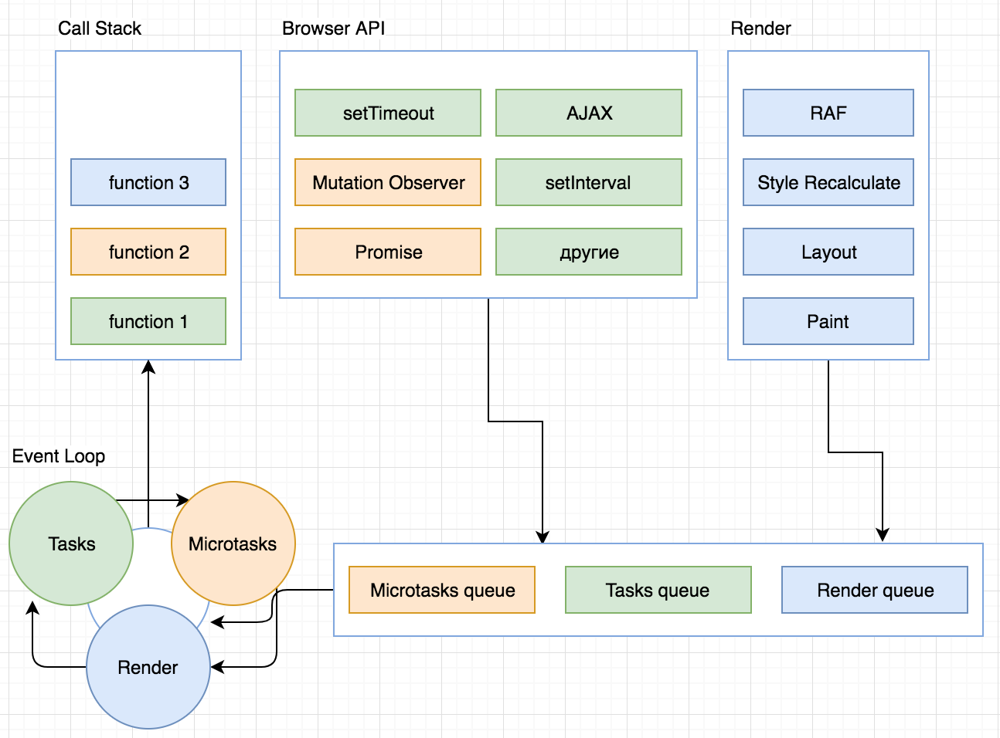
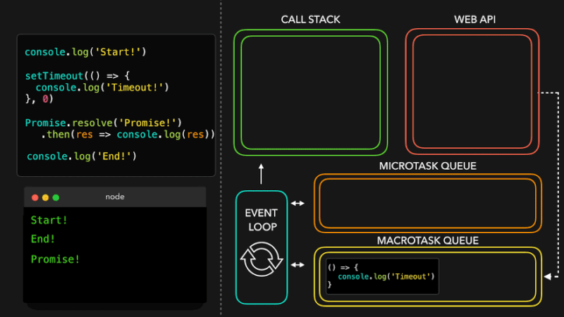

# Движок V8

## Информация

> На примере движка V8 (Chrome, Node.js) описана архитектура среды выполнения JS

::: tip V8

- **V8** - движок JavaScript с открытым исходным кодом
- Входит в релиз Chromium
  :::

## Составные части

<v-details title="1. Heap">

::: tip Heap

- **Heap / Memory Heap (куча)** - структура данных, с помощью которой реализована динамически распределяемая память приложения
  :::

- Место, где происходит выделение памяти
- Куча - ссылка на определённую неструктурированную область памяти
- Содержит объекты, на которые ссылаются переменные программы
- memory allocation

</v-details>

<v-details title="2. Call Stack">

::: tip Call Stack

- **Стек вызовов (Call Stack)** - место, куда в процессе выполнения кода попадают так называемые стековые кадры
  :::

- **Call Stack** - стек вызовов LIFO структура (последний вошедший выходит первым)
- В стек помещаются и удаляются аргументы, локальные переменные функций по мере выполнения программы. Синхронные функции помещаются в стек вызова сразу. Асинхронные откладываются в специальную таблицу - _Event Table_, где ожидают дальнейшей обработки, чтобы не блокировать процесс выполнения программы. Видно какая функция какую вызвала (_execution context_)
- Стек вызовов - это структура данных, которая, записывает сведения о месте в программе, где мы находимся. Если мы переходим в функцию, мы помещаем запись о ней в верхнюю часть стека. Когда мы из функции возвращаемся, мы вытаскиваем из стека самый верхний элемент и оказываемся там, откуда вызывали эту функцию. Каждая запись в стеке вызовов называется стековым кадром
- Если будет достигнут максимальный размер стека (16 000), возникнет переполнение стека

</v-details>

<v-details title="3. Web API, Event Table, Callback Queue, Job Queue">

::: tip Web API

- **Web API** - расширения браузера
  :::

- Event Table и Event Queue являются частью Web API, который реализуют браузеры для того, чтобы использовать такие возможности, как асинхронные запросы, таймеры, обрабатывать DOM события и другое асинхронное поведение. Это не является стандартным функционалом JavaScript и в различных средах данное API может быть реализовано по разному
- Web API - это потоки, к которым у нас нет прямого доступа, мы можем лишь выполнять обращения к ним. Они встроены в браузер, где и выполняются асинхронные действия

::: tip Event Table

- **Event Table** - таблица в которой находится информация о том, по какому событию необходимо поместить функцию в Event Queue (очередь событий)
  :::

::: tip Callback/Event/Task Queue

- **Callback/Event/Task Queue** - очередь задач/событий - FIFO структура (раньше выходят элементы, которые раньше были помещены). В ней находятся асинхронные функции, для которых наступило время запуска

:::

::: tip Job Queue (ES6)

- **Job Queue (ES6)** - очередь заданий (микротаски) Эта конструкцию можно считать слоем, расположенном поверх очереди цикла событий. Очередь заданий — это очередь, которая присоединена к концу каждого тика в очереди цикла событий

:::

</v-details>

<v-details title="4. Event Loop">

::: tip Event Loop

- **Event Loop** - цикл/петля событий - наблюдает за стеком вызовов и очередью коллбэков (callback queue). Если стек вызовов пуст, цикл берёт первое событие из очереди и помещает его в стек, что приводит к запуску этого события на выполнение. Подобная итерация называется тиком (tick) цикла событий. Каждое событие - это просто коллбэк
  :::

- Позволяет запланировать выполнение асинхронного кода сразу после выполнения синхронного кода

</v-details>

---

## Принцип работы на схемах

::: details Общая структура

:::

::: details Виды очередей

:::

::: details Анимация работы

:::

## Краеугольные камни движка V8

- Компиляция исходного кода JavaScript непосредственно в собственный машинный код, минуя стадию промежуточного байт-кода
- Эффективная система управления памятью, приводящая к быстрому объектному выделению и маленьким паузам сборки «мусора»
- Введение скрытых классов и встроенных кэшей, ускоряющих доступ к свойствам и вызовам функций
