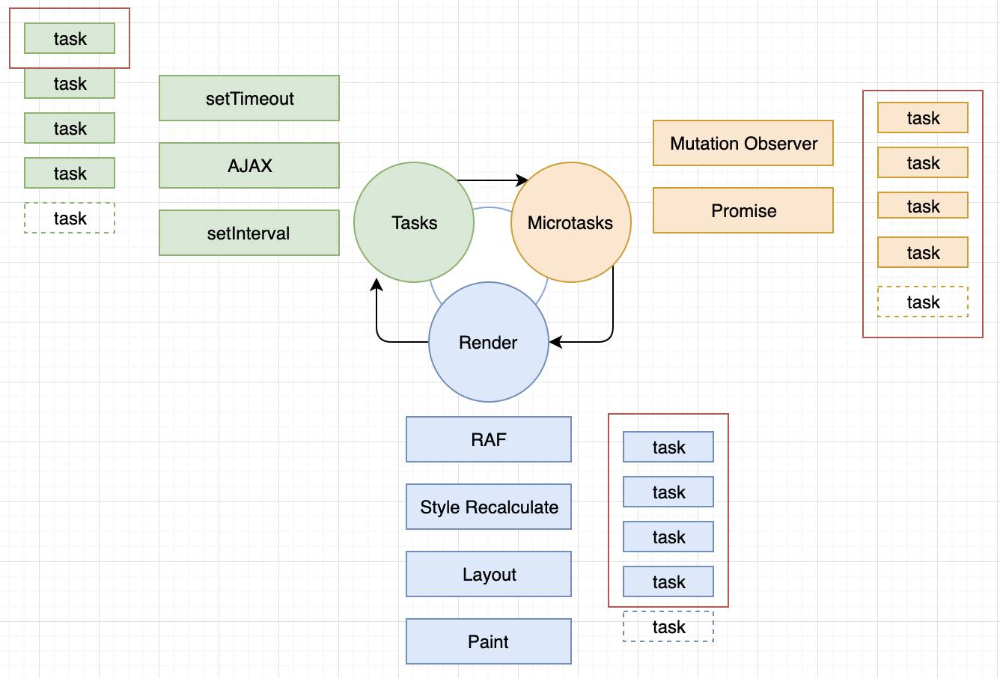

# Виды задач

## Задачи

### 1. Microtasks

> Очередь микрозадач / задания "jobs" (_выполняются все_)

> `Promises`, `process.nextTick`, `Object.observe`, `Mutation Observer`

Микрозадачи исполняются по порядку:

- Каждый раз после таски
- Каждый раз когда пустеет стек
- Могут выполняться посередине таска, если очистился стек
- Рекурсивный вызов блокирует Event Loop
- _Promise.then_ - микротаск _then_. _Promise.then.then_ - 2 микротаска
- Сначала выполняется _microtasks_, затем _tasks_

---

- Если что-то выполняется, то выполняется 1 раз
- Затем происходит цикл рендеринга
- Если появляется что-то еще, оно планируется

### 2. Render Tasks (Animation Callbacks)

> `requestAnimationFrame`, `Style Recalculate`, `Layout`, `Paint`, `I/O`, `Рендеринг пользовательского интерфейса`

- Задачи от Render оптимизируются браузером и, если он посчитает, что в этом цикле не нужно ничего перерисовывать, то Event Loop просто пойдет дальше

---

- Вся запланированная очередь выполняется разом
- Все остальное планируется на следующий раз и добавляется сверху на следующий фрейм

### 3. Macrotask (Tasks)

> Очередь задач (_выполняются по одной_)

> `setTimeout`, `setInterval`, `setImmediate`, `AJAX`

- Выполняют всё по очереди, даже если есть что-то, что добавлено было сверху
- Браузер может рендерить в промежутках между ними
- Если скорость обработки равна скорости их добавления, то это бесконечный цикл и Event Loop ничего не может сделать, пока не закончатся микротаски
- Поэтому микротаски блокируют рендеринг

## Схема

