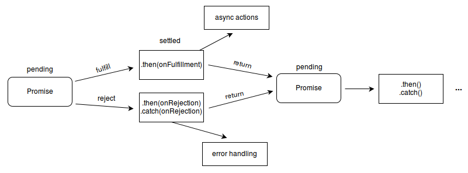

# Информация

## Информация

::: info

- https://www.youtube.com/watch?v=1idOY3C1gYU - YouTube
- https://dev.to/lydiahallie/javascript-visualized-promises-async-await-5gke - JavaScript Visualized: Promises & Async/Await
  :::

::: tip

- **Promise** - специальный объект, который используются для обработки результатов асинхронных операций. Промис хранит своё состояние, текущий результат (если есть) и коллбэки
- **Промисификация** - обертка над асинхронным функционалом, возвращающая промис
- **Чейнинг (chaining)** - возможность стоить асинхронные цепочки из промисов .then…then…then, в каждый следующий then переходит результат от предыдущего
  :::

## Способ использования

1. Код, которому нужно сделать что-то асинхронно, создаёт экземпляр объекта через `new Promise` и возвращает его
2. При создании `new Promise` автоматически запускается функция-аргумент, которая должна вызвать `resolve(result)` при успешном выполнении и `reject(error)` - при ошибке
3. Внешний код, получив promise, навешивает на него обработчики `.then` и `.catch`
4. По завершении процесса асинхронный код переводит promise в состояние **fulfilled** (с результатом) или **rejected** (с ошибкой). При этом автоматически вызываются соответствующие обработчики во внешнем коде `.then` и `.catch`

## Состояния и коллбэки

### Состояния

1. **pending** - ожидание (выполняется)
2. **fulfilled** - выполнено успешно
3. **rejected** - отклонено (выполнено с ошибкой)

### Навешиваемые коллбэки

- `onFulfilled` – срабатывают, когда promise в состоянии fulfilled
- `onRejected` – срабатывают, когда promise в состоянии rejected



### Пример

```js
let promise = new Promise(function (resolve, reject) {
  resolve(arg); // => onFulfilled(arg) => .then(arg)  => Promise
  reject(arg); // => onRejected(arg)  => .catch(arg) => Promise
});
```

## Категории

### Минусы промисов

- Нельзя отменить
- Метод `finally` не особо кроссбраузерный

### Использование метода finally

- finally не меняет состояние промиса
- _Пример использования_: скрыть лоадер (неважно ошибка или успешно)

### Комментарии

- При взаимодействии с API `catch` используется для обработки _http статусов 4xx 5xx_, `then` это статусы _2xx_
- Состояние промиса изменяется 1 раз
- Promise после `reject`/`resolve` - неизменны
- Отсутствие внешнего `catch` не останавливает выполнение скрипта. Когда обработчик в промисах делает `throw` - в данном случае, при ошибке запроса, то такая ошибка не останавливает выполнение скрипта и не выводится в консоли. Она просто будет передана в ближайший следующий обработчик `onRejected`.
