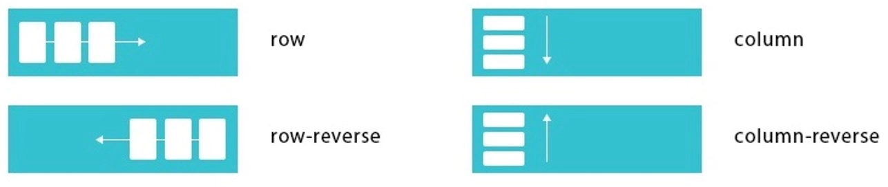
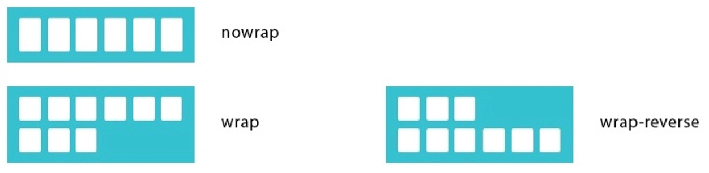

# Flex-flow

## CSS-свойства

### `flex-flow`, `flex-direction`, `flex-wrap`

`flex-flow: row nowrap` (составное свойство)

**Состоит из:**

::: details `flex-direction: row`

- Задаёт направление основных осей в flex-контейнере

| Значение         | Описание                                          |
| ---------------- | ------------------------------------------------- |
| `row`            | Расположение блоков по горизонтали (по умолчанию) |
| `row-reverse`    | Расположение блоков по горизонтали (реверсионно)  |
| `column`         | Расположение блоков по вертикали                  |
| `column-reverse` | Расположение блоков по вертикали (реверсионно)    |



```css
.flex-container {
  flex-direction: row;
  flex-direction: row-reverse;
  flex-direction: column;
  flex-direction: column-reverse;
}
```

:::

::: details `flex-wrap: nowrap`

- Задает перенос flex-элементов

| Значение       | Описание                                          |
| -------------- | ------------------------------------------------- |
| `nowrap`       | Флексы выстраиваются в одну линию                 |
| `wrap`         | Флексы выстраиваются в несколько строк            |
| `wrap-reverse` | Флексы выстраиваются в несколько строк реверсивно |



```css
.flex-container {
  flex-wrap: nowrap;
  flex-wrap: wrap;
  flex-wrap: wrap-reverse;
}
```

:::

---

**Полная форма записи**

```css
.flex-container {
  flex-direction: row;
  flex-wrap: nowrap;
}
```

**Сокращенная форма записи**

```css
.flex-container {
  flex-flow: row nowrap;
}
```
