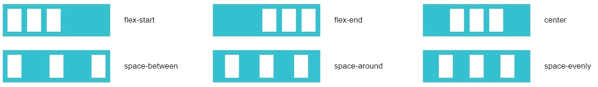
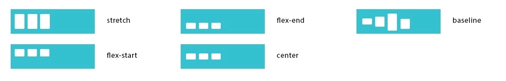
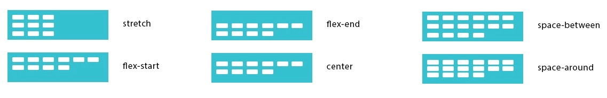

# Выравнивание контента

## CSS-свойства

### `justify-content`, `align-items`, `align-content`

::: details `justify-content: flex-start`

- Управляет размещением элемента вдоль главной оси (по горизонтали)

| Значение        | Описание                                                                                                                             |
| --------------- | ------------------------------------------------------------------------------------------------------------------------------------ |
| `flex-start`    | Флексы прижаты к началу строки                                                                                                       |
| `flex-end`      | Флексы прижаты к концу строки                                                                                                        |
| `center`        | Флексы выравниваются по центру строки                                                                                                |
| `space-between` | Флексы равномерно располагаются с одинаковыми расстояниями между ними (первый и последний элемент прижимаются к краям контейнера)    |
| `space-around`  | Флексы равномерно располагаются с одинаковыми расстояниями вокруг них (первый и последний элемент не прижимаются к краям контейнера) |
| `space-evenly`  | Флексы распределяются таким образом, чтобы расстояние между любыми двумя элементами (и расстояние до краев) было одинаковым          |



```css
.flex-container {
  justify-content: flex-start;
  justify-content: flex-end;
  justify-content: center;
  justify-content: space-between;
  justify-content: space-around;
  justify-content: space-evenly;
}
```

:::

::: details `align-items: stretch`

- Управляет размещением элемента вдоль второстепенной оси (по вертикали)

| Значение     | Описание                                                                               |
| ------------ | -------------------------------------------------------------------------------------- |
| `flex-start` | Флексы выравниваются в начале поперечной оси контейнера                                |
| `flex-end`   | Флексы выравниваются в конце поперечной оси контейнера                                 |
| `center`     | Флексы выравниваются по линии поперечной оси                                           |
| `stretch`    | Флексы растягиваются таким образом, чтобы занять всё доступное пространство контейнера |
| `baseline`   | Флексы выравниваются по их базовой линии (по нижней части параграфа)                   |



```css
.flex-container {
  align-items: flex-start;
  align-items: flex-end;
  align-items: center;
  align-items: stretch;
  align-items: baseline;
}
```

:::

::: details `align-content: stretch`

- Выравнивание многострочных элементов по вертикали (указывает, как несколько рядов должны отделяться друг от друга)
- align-content отвечает за расстояние между рядами, в то время как align-items отвечает за то, как элементы в целом будут выровнены в контейнере. Когда только один ряд, align-content ни на что не влияет

| Значение        | Описание                                                                                                                             |
| --------------- | ------------------------------------------------------------------------------------------------------------------------------------ |
| `flex-start`    | Флексы располагаются в начале поперечной оси. Каждая следующая строка идёт вровень с предыдущей                                      |
| `flex-end`      | Флексы располагаются начиная с конца поперечной оси. Каждая предыдущая строка идёт вровень со следующей                              |
| `center`        | Флексы располагаются по центру контейнера                                                                                            |
| `space-between` | Флексы равномерно располагаются с одинаковыми расстояниями между ними (первый и последний элемент прижимаются к краям контейнера)    |
| `space-around`  | Флексы равномерно располагаются с одинаковыми расстояниями вокруг них (первый и последний элемент не прижимаются к краям контейнера) |
| `stretch`       | Флексы растягиваются, заполняя контейнер равномерно (по умолчанию)                                                                   |



```css
.flex-container {
  align-content: flex-start;
  align-content: flex-end;
  align-content: center;
  align-content: space-between;
  align-content: space-around;
  align-content: stretch;
}
```

:::
