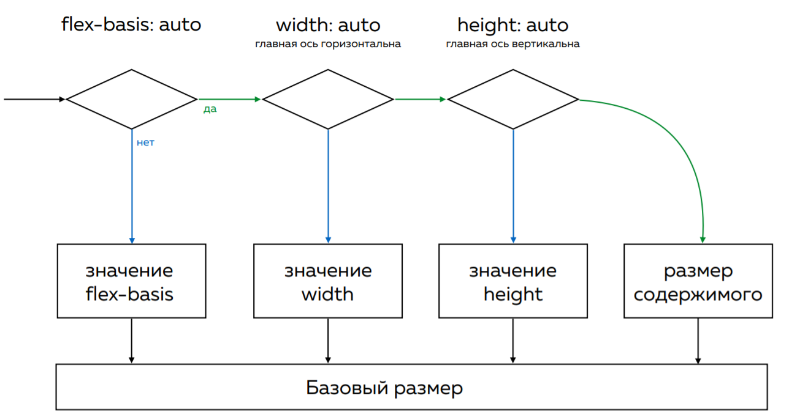

# Flex

## CSS-свойства

### `flex`, `flex-grow`, `flex-shrink`, `flex-basis`

`flex: 0 1 auto` (составное свойство)

**Состоит из:**

::: details `flex-grow: 0`

- Определяет для flex-элемента возможность растягиваться по ширине
- `flex-grow: 2` - это равные 2 части от container-flex (заполнят всю ширину блока)

```css
.flex-element {
  flex-grow: 2;
}
```

:::

::: details `flex-shrink: 1`

- Определяет возможность блока ужиматься при необходимости
- Необходимо задать ширину элемента

```css
.flex-element {
  flex-shrink: 2;
}
```

:::

::: details `flex-basis: auto`

- Базовый размер отдельно взятого блока. Задает размер элемента вдоль главной оси
- При `flex-direction: row` соответствует CSS-свойству `width`
- При `flex-direction: column` соответствует CSS-свойству `height`



```css
.flex-element {
  /* Вместо width */
  flex-basis: 100px;
  /* Дополнительное пространство вокруг контента не учитывается */
  flex-basis: 0;
  /* Дополнительное пространство распределяется на основе его значения flex-grow */
  flex-basis: auto;
}
```

:::

## Варианты

- Блоки растягиваются на всю ширину контейнера (`flex = flex-grow = 1`)

```css
.flex-element {
  /* Значение по-умолчанию */
  flex: auto;
  /* Занимают равное место, пока влезают */
  flex: 1 1 auto;
  /* Указали фиксированную минимальную ширину */
  flex: 1 1 250px;
}
```
