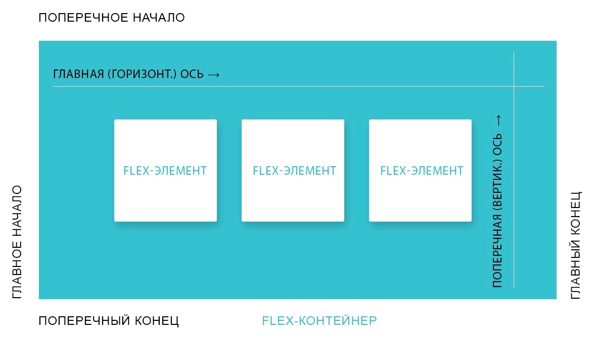

# Информация

::: info

- https://css-tricks.com/snippets/css/a-guide-to-flexbox/ - A Complete Guide to Flexbox
- https://flexboxfroggy.com/#ru - Игра Flexbox Froggy
- https://github.com/philipwalton/flexbugs - Flexbugs
- https://www.outpan.com/app/1b970b008f/flexbox-playground - Flexbox Playground
  :::

## Информация

### Структура

> **Main Axis** - главная ось (по горизонтали)
> **Cross Axis** - второстепенная ось (по вертикали)

### Flexbox и блочная модель

- Не работает `float`
- Внешние отступы не схлопываются и не выпадают
