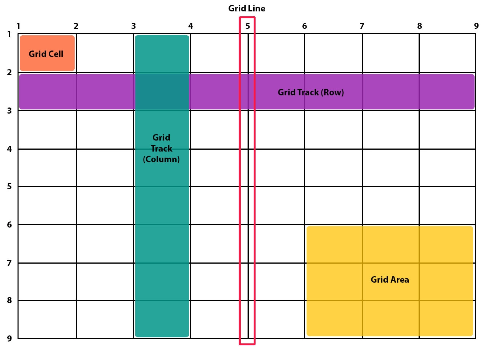

# Информация

::: info

- https://developer.mozilla.org/ru/docs/Web/CSS/CSS_Grid_Layout/ - MDN
- https://css-tricks.com/complete-guide-css-grid-layout/ - A Complete Guide to Grid
- https://cssgridgarden.com/#ru - Игра Grid Garden
  :::

## Информация

### Определения

> **Grid Track** - расстояние между ближайшими двумя линиями, колонка или строка
> **Grid Line** - линия, создаваемая Grid Track. `gap` - толщина линии
> **Grid Cell** - ячейка сетки
> **Grid Area** - область всегда прямоугольная. объединение нескольких ячеек в одну
> **Line-based placement** - позиционирование на основе линий

## Примеры

<v-details title="Базовый пример">
<v-iframe height="450" src="https://codepen.io/LetsCode-Dev/embed/jOorYjB" />
</v-details>
