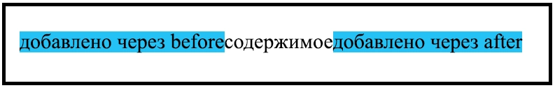

# ::before и ::after

## CSS псевдоэлементы

| Значение   | Описание                                |
| ---------- | --------------------------------------- |
| `::before` | Добавляет content перед контентом блока |
| `::after`  | Добавляет content после контента блока  |

## Использование



```html
<div>Содержимое</div>
```

```css
div {
  padding: 20px;
  width: 400px;
}
div::before {
  content: "Добавлено через before";
  background-color: blue;
}
div::after {
  content: "Добавлено через after";
  background-color: blue;
}
```

## Примеры

::: details Добавление блока с изображением
**Связка свойств**

- `nth-child`
- `before`
  <v-iframe height="450" src="https://codepen.io/LetsCode-Dev/embed/MWdegoB" />
  :::

::: details По наведению на изображение добавляется полупрозрачный слой
**Связка свойств**

- `position`
- `before` / `after`
- `hover`
- `transition`
  <v-iframe height="450" src="https://codepen.io/LetsCode-Dev/embed/bGyebOL" />
  :::

::: details CSS Transition Button
**Связка свойств**

- `before`
- `after`
  <v-iframe height="450" src="https://codepen.io/LetsCode-Dev/embed/wvbWvox" />
  :::

::: details Линия до и после текста
<v-iframe height="450" src="https://codepen.io/LetsCode-Dev/embed/OJYXadB" />
:::
