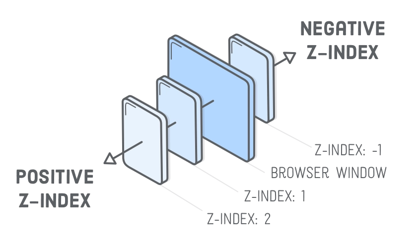

# position

## CSS-свойства

::: details `position` - позиционирование блочных элементов
| Значение | Описание |
| --- | --- |
| `static` | Статичное (стандартное позиционирование) |
| `relative` | Относительное (положение устанавливается относительно его исходного места) |
| `absolute` | Абсолютное (отсчёт координат ведётся от края окна браузера, если у родителя не установлено position: relative) |
| `fixed` | Фиксированное (привязывается к указанной свойствами left, top, right и bottom точке на экране) |
| `sticky` | Сочетание относительного и фиксированного позиционирования | - `static` и `relative` сохраняют своё естественное положение в потоке документа - `absolute` и `fixed` «вырываются» из потока документа и становятся плавающими

```css
div {
  position: static;
  position: relative;
  position: absolute;
  position: fixed;
  position: sticky;
}
```

:::

::: details `left` `right` `top` `bottom` - задание расстояния

- Применяются для всех видов позиционирования кроме `static`

```css
div {
  position: relative;
  top: 100px;
  left: 70px;
}
```

:::

::: details `z-index` - задание порядка расположения элементов

```css
div {
  z-index: 1;
}
```



:::

## Примеры

<v-details title="Overlay (CSS position)">
<v-iframe height="450" src="https://codepen.io/LetsCode-Dev/embed/JjqKeBb" />
</v-details>
