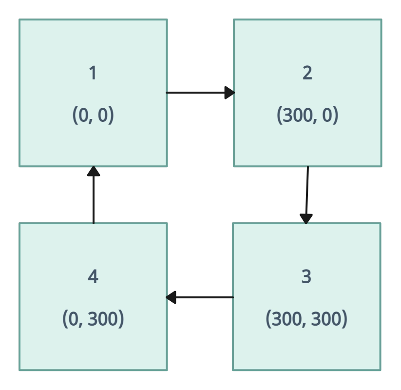

# animation и @keyframes

## CSS-свойства

::: details `animation` (составное свойство) - анимация

**Состоит из:**

- `animation-name` \* - название анимации из @keyframes
- `animation-duration` \* - время анимации
- `animation-timing-function` - функция для вычисления промежуточного состояния анимации
- `animation-delay` - задержка для анимации
- `animation-iteration-count` - количество итераций для анимации
- `animation-direction` - указывает, должно ли движение анимации идти в обратную сторону или нет
- `animation-fill-mode` - указывает, какие стили должны применяются до начала анимации и после её завершения
- `animation-play-state` - позволяет проигрывать анимацию или поставить её на паузу

**Полная форма записи**

- Здесь “move” - это название анимации, объявленное в @keyframes

```css
div {
  animation-name: move;
  animation-duration: 0s;
  animation-timing-function: ease;
  animation-delay: 0s;
  animation-iteration-count: 1;
  animation-direction: normal;
  animation-fill-mode: none;
  animation-play-state: running;
}
```

**Сокращенная форма записи**

- Здесь “move” - это название анимации, объявленное в @keyframes

```css
div {
  animation: move 0s ease 0s 1 normal none running;
}
```

:::

## CSS-правила

::: details `@keyframes`

**Пример задания @keyframes**

- `@keyframes` - ключевое слово
- `colored` - название анимации (будет использовать в CSS-свойстве animation-name)
- `0%` `25%` `50%` `75%` `100%` - кадры анимации. В примере шаг задан 25%, поэтому кадры будут сменяться с одинаковой периодичностью. Допускается задание любых процентных значений

```css
@keyframes colored {
  0% {
    background-color: white;
  }
  25% {
    background-color: orange;
  }
  50% {
    background-color: yellow;
  }
  75% {
    background-color: yellowgreen;
  }
  100% {
    background-color: white;
  }
}
div {
  animation: colored 5s;
}
```

:::

## CSS-функции

::: warning

- Добавить в `animation-timing-function`
  :::

::: details `steps()`
**Данные**

- Используется для свойства animation-timing-function
- Функция CSS steps() определяет переход, который делит входное время на указанное количество интервалов одинаковой длины
- Позволяет устанавливать время замедления анимации, что обеспечивает большую степень контроля над тем, какая часть анимации происходит и когда
- Найден реальный пример употребления этого приёма: логотип [Impending](http://impending.com/).

**Ссылки**

- https://designmodo.com/steps-css-animations/
- https://developer.mozilla.org/en-US/docs/Web/CSS/easing-function/steps

```css
div {
  animation: 2s infinite alternate steps(10);
}
```

:::

## Демонстрация

### animation-timing-function

::: warning

- Дополнить пример
- https://developer.mozilla.org/en-US/docs/Web/CSS/animation-timing-function
  :::

<v-iframe height="550" src="https://codepen.io/LetsCode-Dev/embed/emOLjzB" />

## Примеры

### Примеры

<v-details title="Пример анимации">
- В примере, блок перемещается по часовой стрелке. Для перемещения используется `transform: translate()`

<v-iframe height="450" src="https://codepen.io/LetsCode-Dev/embed/jOoqQBR" />
</v-details>

### Ссылки на различные анимации с CodePen

::: info

- https://codepen.io/simurai/pen/krWaKX - Steps Animation
- https://codepen.io/Wujek_Greg/pen/KRXYpg - Pure CSS watch animation
- https://codepen.io/jenning/pen/YzNmzaV - Simple CSS loaders
- https://codepen.io/Venerons/pen/dyNdLL - CSS Shape Animation
- https://codepen.io/alphardex/pen/WNNVJeZ - Rotating Text
- https://codepen.io/Rplus/pen/abPLGx - [PURE CSS] border animation without svg
  :::
