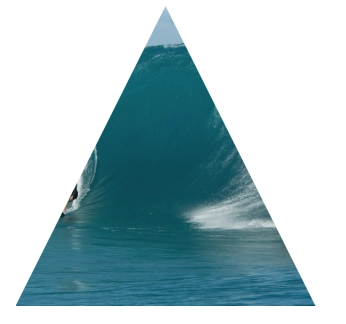

# clip-path

## Ссылки

::: info

- https://webref.ru/layout/shapes-polygon
- https://bennettfeely.com/clippy/
  :::

## Фигуры

<v-two fix>
  <template #first>



  </template>

<template #last>

```css
div {
  width: 300px;
  height: 300px;
  clip-path: polygon(50% 0%, 100% 100%, 0 100%);
}
```

</template>
</v-two>

## Примеры

<v-details title="Применение clip-path">
<v-iframe height="450" src="https://codepen.io/LetsCode-Dev/embed/abrNPdV" />
</v-details>
