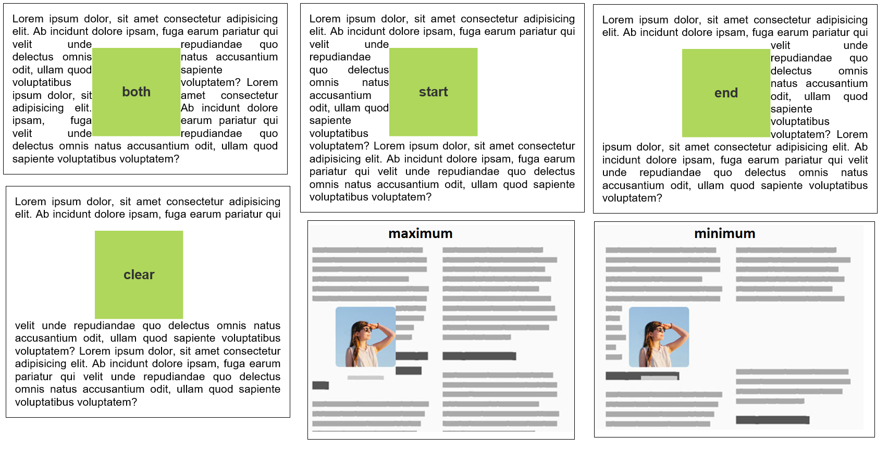

# CSS Exclusions (IE)

> **CSS Exclusions** - обтекание элемента, который находится вне потока и спозиционирован поверх контента с помощью absolute, relative, fixed

## CSS-свойства

::: details `wrap-flow` - задаёт область исключения, а также способ, которым содержимое должно обтекать его

```css
div {
  -ms-wrap-flow: start;
  -ms-wrap-flow: end;
  -ms-wrap-flow: maximum;
  -ms-wrap-flow: minimum;
  -ms-wrap-flow: clear;
  -ms-wrap-flow: both;
}
```

- `start` - будет огибать содержимое вокруг начала области исключения, оставив конец области пустым
- `end `- будет огибать содержимое в конце области исключения
- `maximum `- содержимое будет обёрнуто вокруг области исключения, где бы не было найдено более широкое пространство в области контейнера
- `minimum `- текст будет проходить через самое узкое пространство, доступное вокруг зоны исключения
- `clear `- очистит правую и левую часть области исключения, позволяет обтекаемому тексту находится только сверху и снизу области исключения
- `both `- обтекание со всех сторон



:::

::: details `wrap-margin` - устанавливает границу или отступ вокруг области исключения

```css
div {
  -ms-wrap-margin: 10px; /* Корректно */
  -ms-wrap-margin: -10px; /* Некорректно */
  -ms-wrap-margin: 10px 20px 10px 30px; /* Некорректно */
}
```

:::
