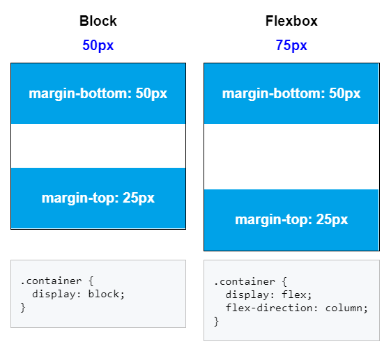

# Схлопывание внешних отступов

## Варианты

- `display: block` - в вертикальном направлении margin не складываются, а выбирается максимальный из доступных
- `display: flex` - при "flex-direction: column", margin суммируются

