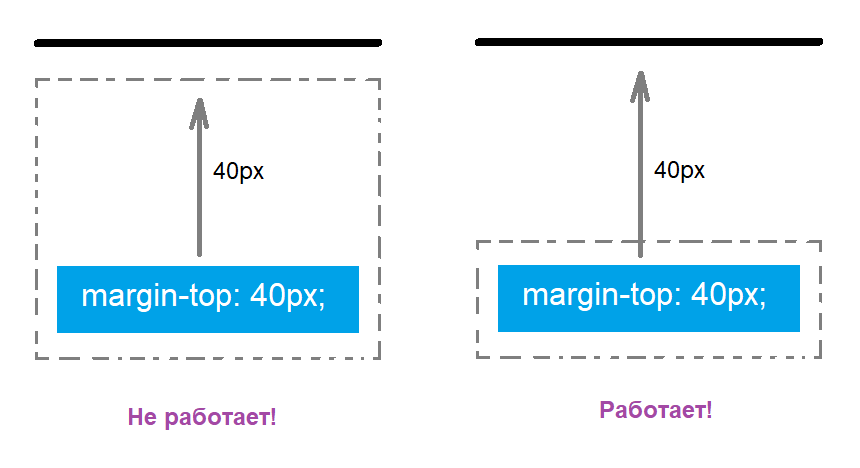

# Выпадение внешних отступов

## Данные

- В вертикальном направлении margin вложенного блока может выпадать из родительского и отталкивать оба блока



## Как бороться с выпаданием?

- Родительскому блоку можно задать одно из следующих свойств:

```css
div {
  /* 1. Использовать осторожно */
  overflow: hidden;

  /* 2. padding-top или padding-bottom */
  padding-top: 1px;
  padding-bottom: 1px;

  /* 3. border-top или border-bottom */
  border-top: 1px solid transparent;
  border-bottom: 1px solid transparent;
}
```
