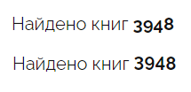

# font-feature-settings

::: info

- https://ru.w3docs.com/uchebnik-css/css-svoistvo-font-feature-settings.html
  :::

## CSS-свойства

### `font-feature-settings`

::: tip `font-feature-settings`

- **font-feature-settings** - устранение "прыгающих" букв
  :::

## Пример

```css
div {
  font-feature-settings:
    "pnum" on,
    "lnum" on;
}
```


