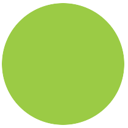

# Background

## Данные

<v-two fix>
  <template #first>
    
  </template>

<template #last>

```html
<div class="pie"></div>
```

```css
.pie {
  width: 200px;
  height: 200px;
  background: url('data:image/svg+xml,\
		<svg xmlns="http://www.w3.org/2000/svg" viewBox="0 0 200 200">\
			<circle r="100" cx="100" cy="100" fill="yellowgreen" />\
		</svg>');
}
```

</template>
</v-two>
