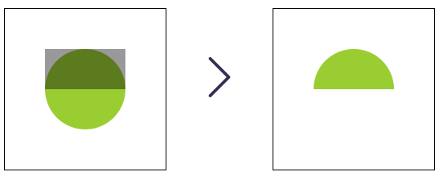

# clipPath

## Данные

### `<clipPath>`



```html
<svg viewBox="0 0 100 100" width="200px" height="200px">
  <defs>
    <clipPath id="clip">
      <rect width="50px" height="25px" x="25" y="25" fill="blue" />
    </clipPath>
  </defs>

  <circle cx="50" cy="50" r="25" fill="yellowgreen" clip-path="url(#clip)" />
</svg>
```

- По центру нарисован круг. Атрибут clip-path ссылается на элемент clipPath, который содержит элемент rect
- При этом сам прямоугольник отрисован не будет. Вместо этого прямоугольник задаст область отрисовки. Так как прямоугольник перекрывает только верхнюю половину круга, нижняя половина круга исчезает
- Теперь мы получили полуокружность без необходимости использования элемента path. При обрезке каждый путь внутри clipPath проверяется и оценивается вместе с его свойствами stroke и transform. Другими словами, все что не находится в залитой области clipPath не будет отображено. Цвет, непрозрачность и т. д. не влияют на результат
