# Фигуры

## Список фигур

### `<rect />` - прямоугольник

<v-two fix>
  <template #first>
    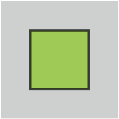
  </template>

<template #last>

```html
<svg viewBox="0 0 100 100">
  <rect x="25" y="25" width="50px" height="50px" />
</svg>
```

</template>
</v-two>

<v-two fix>
  <template #first>
    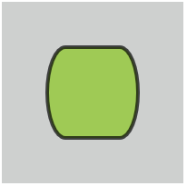
  </template>

<template #last>

```html
<svg viewBox="0 0 100 100">
  <rect x="25" y="25" rx="10" ry="50" width="50px" height="50px" />
</svg>
```

</template>
</v-two>

### `<circle />` `<ellipse />` - окружность

<v-two fix>
  <template #first>
    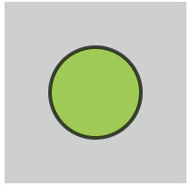
  </template>

<template #last>

```html
<svg viewBox="0 0 100 100">
  <circle cx="50" cy="50" r="25" />
</svg>
```

</template>
</v-two>

<v-two fix>
  <template #first>
    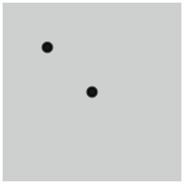
  </template>

<template #last>

```html
<svg>
  <g stroke="black" stroke-width="3" fill="black">
    <circle cx="50" cy="50" r="5" />
    <circle cx="100" cy="100" r="5" />
  </g>
</svg>
```

</template>
</v-two>

<v-two fix>
  <template #first>
    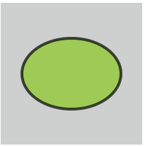
  </template>

<template #last>

```html
<svg viewBox="0 0 100 100">
  <ellipse cx="50" cy="50" rx="35" ry="25" />
</svg>
```

</template>
</v-two>

### `<line />` `<polyline />` - линия

<v-two fix>
  <template #first>
    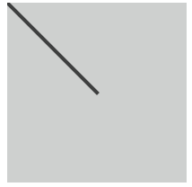
  </template>

<template #last>

```html
<svg viewBox="0 0 100 100">
  <line x1="0" y1="0" x2="50" y2="50" />
</svg>
```

</template>
</v-two>

<v-two fix>
  <template #first>
    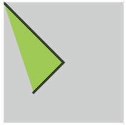
  </template>

<template #last>

```html
<svg viewBox="0 0 100 100">
  <polyline points="0,0 50,50 25,75" />
</svg>
```

</template>
</v-two>

### `<polygon />` - полигон

<v-two fix>
  <template #first>
    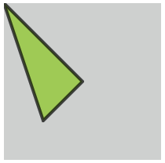
  </template>

<template #last>

```html
<svg viewBox="0 0 100 100">
  <polygon points="0,0 50,50 25,75" />
</svg>
```

</template>
</v-two>

### `<path />` - путь

**Доступные команды:**

- `M` - moveto
- `L` - lineto
- `H` - horizontal lineto
- `V` - vertical lineto
- `C` - curveto
- `S` - smooth curveto
- `Q` - quadratic Bézier curve
- `T` - smooth quadratic Bézier curveto
- `A` - elliptical Arc
- `Z` - closepath

<v-two fix>
  <template #first>
    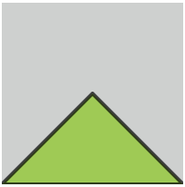
  </template>

<template #last>

```html
<svg viewBox="0 0 100 100">
  <path d="M0,100 L50,50 100,100 Z" />
</svg>
```

</template>
</v-two>

<v-two fix>
  <template #first>
    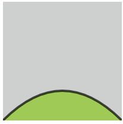
  </template>

<template #last>

```html
<svg viewBox="0 0 100 100">
  <path d="M0,100 Q 50,50 100,100"></path>
</svg>
```

</template>
</v-two>

<v-two fix>
  <template #first>
    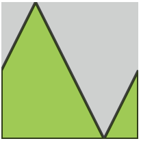
  </template>

<template #last>

```html
<svg viewBox="0 0 100 100" preserveAspectRatio="none">
  <path d="M0,100 L 20,0 80,90 100,0 100,100 Z"></path>
</svg>
```

</template>
</v-two>

<v-two fix>
  <template #first>
    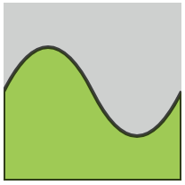
  </template>

<template #last>

```html
<svg viewBox="0 0 100 100" preserveAspectRatio="none">
  <path
    d="
		M0,50 Q 25,0 50,50, 75,100,
		100,50 L100,100 0,100 0,50
	"
  ></path>
</svg>
```

</template>
</v-two>
