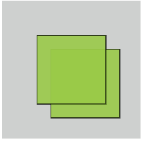
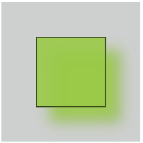
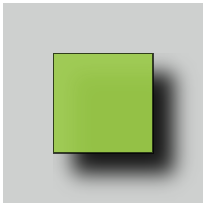
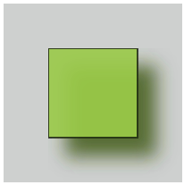

# Фильтры

## Данные

### `<filter>`, `<feGaussianBlur>`, `<feOffset>`, `<feBlend>`, `<feColorMatrix>`

<v-two fix>
  <template #first>
    
  </template>

<template #last>

```html
<svg>
  <defs>
    <filter id="f1" x="0" y="0">
      <feGaussianBlur in="SourceGraphic" stdDeviation="15" />
    </filter>
  </defs>
  <rect width="100px" height="100px" x="50" y="50" filter="url(#f1)" />
</svg>
```

</template>
</v-two>

<v-two fix>
  <template #first>
    
  </template>

<template #last>

```html
<svg>
  <defs>
    <filter id="f2" x="0" y="0" width="200%" height="200%">
      <feOffset result="offOut" in="SourceGraphic" dx="20" dy="20" />
      <feGaussianBlur result="blurOut" in="offOut" stdDeviation="10" />
      <feBlend in="SourceGraphic" in2="offOut" mode="normal" />
    </filter>
  </defs>
  <rect width="100px" height="100px" x="50" y="50" filter="url(#f2)" />
</svg>
```

</template>
</v-two>

<v-two fix>
  <template #first>
    
  </template>

<template #last>

```html
<svg>
  <defs>
    <filter id="f3" x="0" y="0" width="200%" height="200%">
      <feOffset result="offOut" in="SourceGraphic" dx="20" dy="20" />
      <feGaussianBlur result="blurOut" in="offOut" stdDeviation="10" />
      <feBlend in="SourceGraphic" in2="blurOut" mode="normal" />
    </filter>
  </defs>
  <rect width="100px" height="100px" x="50" y="50" filter="url(#f3)" />
</svg>
```

</template>
</v-two>

<v-two fix>
  <template #first>
    
  </template>

<template #last>

```html
<svg>
  <defs>
    <filter id="f4" x="0" y="0" width="200%" height="200%">
      <feOffset result="offOut" in="SourceAlpha" dx="20" dy="20" />
      <feGaussianBlur result="blurOut" in="offOut" stdDeviation="10" />
      <feBlend in="SourceGraphic" in2="blurOut" mode="normal" />
    </filter>
  </defs>
  <rect width="100px" height="100px" x="50" y="50" filter="url(#f4)" />
</svg>
```

</template>
</v-two>

<v-two fix>
  <template #first>
    
  </template>

<template #last>

```html
<svg>
  <defs>
    <filter id="f5" x="0" y="0" width="200%" height="200%">
      <feOffset result="offOut" in="SourceGraphic" dx="20" dy="20" />
      <feColorMatrix
        result="matrixOut"
        in="offOut"
        type="matrix"
        values="0.2 0 0 0 0 0 0.2 0 0 0 0 0 0.2 0 0 0 0 0 1 0"
      />
      <feGaussianBlur result="blurOut" in="matrixOut" stdDeviation="10" />
      <feBlend in="SourceGraphic" in2="blurOut" mode="normal" />
    </filter>
  </defs>
  <rect width="100px" height="100px" x="50" y="50" filter="url(#f5)" />
</svg>
```

</template>
</v-two>
