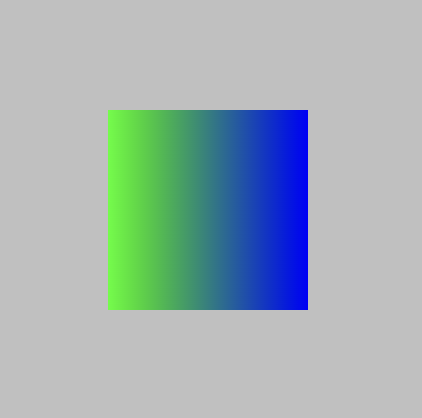
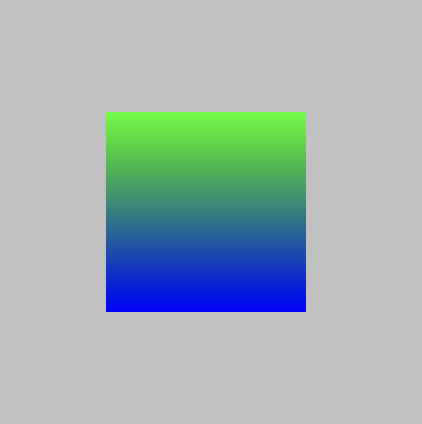
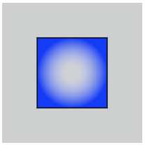
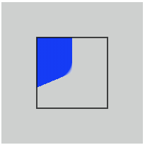

# Градиенты

## Данные

### Linear Gradient: `<linearGradient>`

<v-two fix>
  <template #first>
    
  </template>

<template #last>

```html
<svg>
  <defs>
    <linearGradient id="grad1" x1="0%" y1="0%" x2="100%" y2="0%">
      <stop offset="0%" style="stop-color:rgb(255,255,0);stop-opacity:1" />
      <stop offset="100%" style="stop-color:rgb(0,0,255);stop-opacity:1" />
    </linearGradient>
  </defs>
  <rect width="100px" height="100px" x="50" y="50" fill="url(#grad1)" />
</svg>
```

</template>
</v-two>

<v-two fix>
  <template #first>
    
  </template>

<template #last>

```html
<svg>
  <defs>
    <linearGradient id="grad2" x1="0%" y1="0%" x2="0%" y2="100%">
      <stop offset="0%" style="stop-color:rgb(255,255,0);stop-opacity:1" />
      <stop offset="100%" style="stop-color:rgb(0,0,255);stop-opacity:1" />
    </linearGradient>
  </defs>
  <rect width="100px" height="100px" x="50" y="50" fill="url(#grad2)" />
</svg>
```

</template>
</v-two>

### Radial Gradient: `<radialGradient>`

<v-two fix>
  <template #first>
    
  </template>

<template #last>

```html
<svg>
  <defs>
    <radialGradient id="grad3" cx="50%" cy="50%" r="50%" fx="50%" fy="50%">
      <stop offset="0%" style="stop-color:rgb(255,255,255);stop-opacity:0" />
      <stop offset="100%" style="stop-color:rgb(0,0,255);stop-opacity:1" />
    </radialGradient>
  </defs>
  <rect width="100px" height="100px" x="50" y="50" fill="url(#grad3)" />
</svg>
```

</template>
</v-two>

<v-two fix>
  <template #first>
    
  </template>

<template #last>

```html
<svg>
  <defs>
    <radialGradient id="grad4" cx="20%" cy="30%" r="30%" fx="50%" fy="50%">
      <stop offset="0%" style="stop-color:rgb(255,255,255);stop-opacity:0" />
      <stop offset="100%" style="stop-color:rgb(0,0,255);stop-opacity:1" />
    </radialGradient>
  </defs>
  <rect width="100px" height="100px" x="50" y="50" fill="url(#grad4)" />
</svg>
```

</template>
</v-two>
