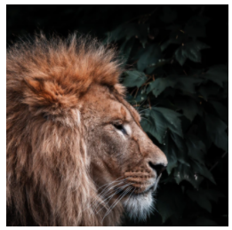

# Изображение

## Данные

### `<image>`

- `preserveAspectRatio="xMinYMin slice"` аналог cover

<v-two fix>
  <template #first>
    
  </template>

<template #last>

```html
<svg viewBox="0 0 100 100" width="200px" height="200px">
  <image
    xlink:href="[https://images.unsplash.com/photo-1607274134639-043342705e6f](https://images.unsplash.com/photo-1607274134639-043342705e6f)"
    width="100%"
    height="100%"
    preserveAspectRatio="xMinYMin slice"
  ></image>
</svg>
```

</template>
</v-two>
