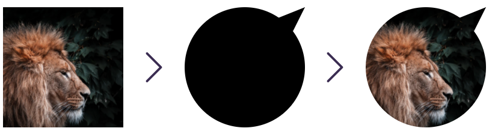

# Маскирование

## Данные

### `<mask>`



```html
<svg viewBox="0 0 100 100" width="200px" height="200px">
  <defs>
    <mask id="mask">
      <circle cx="50" cy="50" r="50" fill="white" />
      <polygon points="100,0 75,10 90,20" fill="white" />
    </mask>
  </defs>

  <image
    mask="url(#mask)"
    xlink:href="https://images.unsplash.com/photo-1607274134639-043342705e6f"
    width="100%"
    height="100%"
    preserveAspectRatio="xMinYMin slice"
  ></image>
</svg>
```
