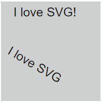
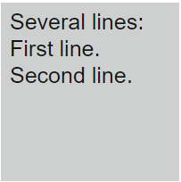
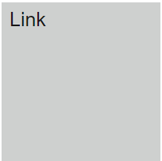

# Текст

## Варианты

### `<text>`, `<tspan>`, `<a>`

<v-two fix>
  <template #first>
    
  </template>

<template #last>

```html
<svg>
  <text x="25" y="30">I love SVG!</text>
  <text x="45" y="100" transform="rotate(30 20,40)">I love SVG</text>
</svg>
```

</template>
</v-two>

<v-two fix>
  <template #first>
    
  </template>

<template #last>

```html
<svg>
  <text x="10" y="30">
    Several lines:
    <tspan x="10" y="60">First line.</tspan>
    <tspan x="10" y="90">Second line.</tspan>
  </text>
</svg>
```

</template>
</v-two>

<v-two fix>
  <template #first>
    
  </template>

<template #last>

```html
<svg>
  <a xlink:href="https://www.yandex.ru/" target="_blank">
    <text x="10" y="30">Link</text>
  </a>
</svg>
```

</template>
</v-two>
