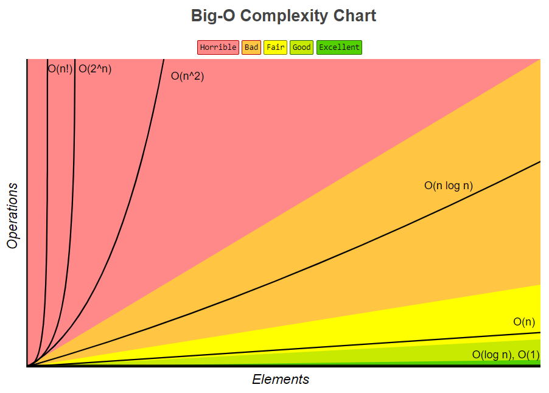

# Варианты

## Варианты

### `O(0)`

- Ничего не происходит

### `O(1)`

- Постоянная величина (константное время)
- Независимо от кол-ва входных данных, требуется 1 операция
- Пример: определить чётное или нечетное число

::: details Пример

```js
function sum(a, b) {
  return a + b;
}
```

:::

### `O(log N)`

- Логарифмическая сложность (бинарный поиск)
- Алгоритм "разделяй и властвуй": есть телефонный справочник, в котором нужно найти телефон. Открываем справочник посередине, отбрасываем половину и т.д.
- Всегда будет меньше чем половина N

### `O(N)`

- Линейная (прямо пропорциональна) сложность
- Зависит от количества передаваемых бит, н-р: 4 элемента - 4 операции
- Пример: перебор массива forEach

::: details Рекурсия

```js
function pow(x, n) {
  if (n != 1) {
    return x * pow(x, n - 1);
  } else {
    return x;
  }
}
```

:::

::: details Цикл для поиска min/max

```js
let min = 1;
let max = 10;
for (let i = 0; i <= 100; i++) {
  if (i < min) min = i;
  if (i > max) max = i;
}
```

---

```js
let min = 1;
let max = 10;
for (let i = 0; i <= 100; i++) {
  if (i < min) min = i;
}
for (let i = 0; i <= 100; i++) {
  if (i > max) max = i;
}
```

:::

### `O(N * log N)`

- Работают большинство алгоритмов сортировки: heap-sort, merge-sort, метод sort JavaScript

### `O(N2) - O(N * N)`

- Квадратичная сложность
- Вложенные действия - умножение
- Пример: цикл в цикле

### `O(2N)`

- Нет данных

### `O(N!)`

- Нет данных

## Схема


```
