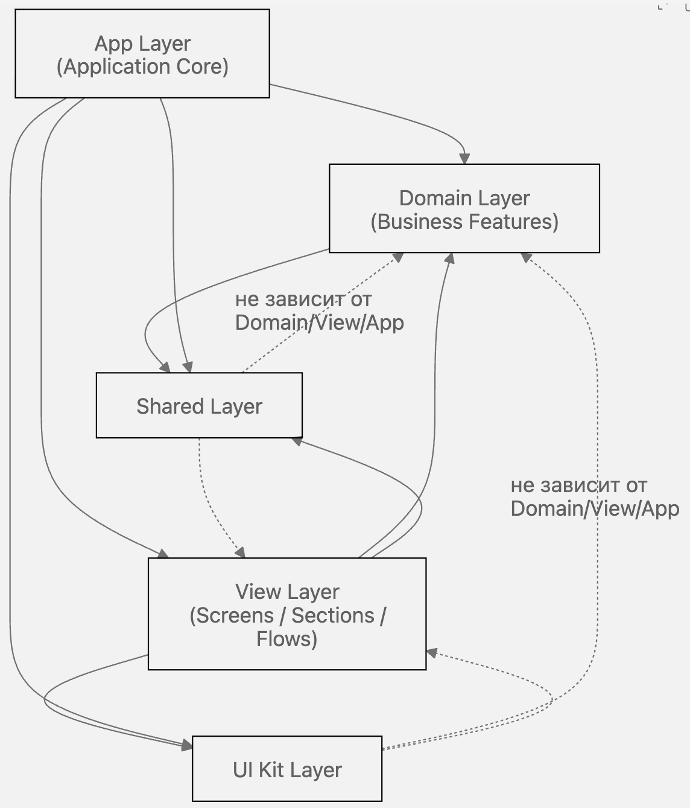

# Слои и правила

## Слои

::: details **`App Layer`** (Application Core) - запуск приложения и глобальные политики
Включает:

- composition root (сборка всех сервисов и зависимостей);
- глобальные провайдеры/контексты;
- инфраструктурные сервисы (ошибки, observability, feature flags, i18n, device/env, healthcheck);
- cross-cutting workflows;
- глобальные reactive effects (подписки, уведомления, модалки, синхронизации).
  :::

::: details **`Domain Layer`** (Business Features) - каждый домен изолирован и содержит свои модели и правила
Включает:

- repository (контракт и реализация доступа к данным);
- store/state model (состояние и бизнес-операции фичи);
- typed errors и validation rules;
- доменные утилиты;
- unit-тесты рядом с кодом.
  :::

::: details **`View Layer`** (Screens / Sections / Flows) - отвечает за отображение и пользовательские сценарии
Включает:

- page views и section views;
- локальную композицию domain-store + workflow;
- форму, диалоги, интерактивные компоненты экрана;
- минимальную glue-логику между UI и доменными методами.

:::

::: details **`Shared Layer`** - общий код, который не принадлежит одному домену
Включает:

- утилиты;
- форматтеры и helpers;
- повторно используемые алгоритмы;
- примитивы, не завязанные на конкретную бизнес-фичу.

:::

::: details **`UI Kit Layer`** - дизайн-система и переиспользуемые визуальные примитивы
Включает:

- базовые UI-компоненты;
- токены и стили;
- low-level интерактивные элементы.
  :::

## Связь слоев

1. `View` использует `Domain` для бизнес-логики и UI Kit для отрисовки.
2. `Domain` может использовать `Shared`, но не `View`/`UI`.
3. `App` оркестрирует всё: инициализация, глобальные эффекты, политики.
4. `Shared` и `UI Kit` — нижние слои, от них зависят остальные, но они сами не знают о верхних слоях.

## Правила

### Правила зависимостей между слоями

- `app` может зависеть от `domains`, `views`, `shared`, `ui-kit`.
- `views` могут зависеть от `domains`, `shared`, `ui-kit`, `components`.
- `domains` могут зависеть от `shared` и контрактов инфраструктуры.
- `shared` не должен зависеть от `domains` и `views`.
- `ui-kit` не должен зависеть от бизнес-доменов.
- Cross-domain взаимодействие допускается только через `app/workflows` или явные контракты.

### Практический checklist при добавлении новой фичи

1. Создать новый домен в `domains/<feature>`.
2. Описать repository-контракт и операции чтения/изменения.
3. Реализовать store с явными loading/error/derived состояниями.
4. Если есть междоменные шаги, добавить workflow в `app/workflows`.
5. Добавить view/section в `views/<feature>`.
6. Подключить фичу в route как thin entrypoint.
7. Добавить unit-тесты для store/workflow и e2e для happy-path.
8. Обновить docs по фиче и архитектурным решениям.

### Состояние и данные

- Разделяйте server state и client state.
- Все запросы и мутации проходят через repository.
- После mutation явно фиксируйте стратегию консистентности: `invalidate`, `selective refetch`, `optimistic update` (если применимо).
- Derived-состояние должно вычисляться рядом с state-моделью, а не в UI.
