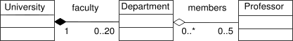

# Композиция

## Информация

::: tip Определения

- **Композиция и Агрегация** - расширение функционала класса за счет "внедрения" других классов
- Об агрегировании также часто говорят как об «отношении принадлежности» по принципу «у машины есть корпус, колёса и двигатель»
- **Агрегация (агрегирование по ссылке)** - отношение «часть-целое» между двумя равноправными объектами, когда один объект (контейнер) имеет ссылку на другой объект. Оба объекта могут существовать независимо: если контейнер будет уничтожен, то его содержимое - нет
- **Композиция (агрегирование по значению)** - более строгий вариант агрегирования, когда включаемый объект может существовать только как часть класса. Если класс будет уничтожен, то и включённый объект тоже будет уничтожен. Объект не может выйти за рамки своего класса. Объект будет создаваться внутри класса при создании класса и будет уничтожаться перед уничтожением родительского класса
- **Функциональная композиция** - передача результа вызова одной функции в качестве аргумента другой функции

:::

## Агрегация и Композиция

- _Агрегация_: профессора - факультеты. Профессора остаются жить после разрушения факультета
- _Композиция_: университет - факультеты. Факультеты без университета уничтожаются

## Наследование и композиция

- **Наследование** - когда класс-наследник имеет все поля и методы родительского класса, и, как правило, добавляет какой-то новый функционал или/и поля
- Наследование предполагает принадлежность к какой-то общности (похожесть). Наследуются атрибуты, т.е. возможности, другого класса, при этом объектов непосредственно родительского класса не создается
- Минус наследования влияние родительского класса на дочерние

---

- **Ассоциация** (частные случаи: Композиция и Агрегация) – когда один класс включает в себя другой класс в качестве одного из полей
- Композиция предполагает формирование целого из частей. При композиции класс-агрегатор создает объекты других классов
