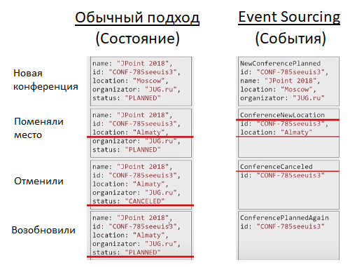

# Event Sourcing

::: tip Определения

- **Event Sourcing** - подход хранения данных, при котором вместо конечного результата (финальное состояние) храниться череда записей о событиях происшедших с некоторой сущностью
- **Event Store** - хранилище в котром запоминаем все действия пользователей в той очередности в которой они пришли
- **Snapshot** - объединяет всю информацию до snapshot
  :::

## Механизмы

- Каждому событию дается имя, которое определяет его значение, т.е. присутствует семантика. Есть огромная разница между «Событие 1» и «Корабль Отплыл»
- Нет ограничений на кол-во событий для сущности. Соответственно новые события могут отражать, как и новые виды совершенных действий, так и расширять уже существующие, скажем, добавили новое свойство в его 2-ой версии
- Произошедшие события неизменны («immutable»)
