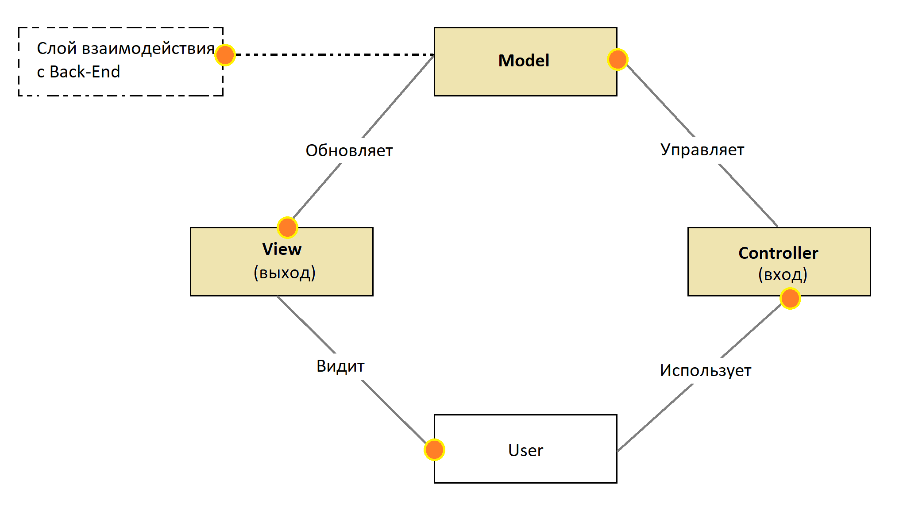

# MVC

## Информация

::: tip Определение

- **Model-View-Controller (MVC)** («Модель-Представление/Вид-Контроллер») - схема разделения данных приложения, пользовательского интерфейса и управляющей логики на три отдельных компонента: модель, представление и контроллер - таким образом, что модификация каждого компонента может осуществляться независимо
  :::

- MVC позволяет следовать принципу разделения ответственностей и способствует написанию чистого кода
- MVC - это модель черного ящика. Есть входы (действия пользователя), есть выходы (это реакция интерфейса), есть внутренняя логика (модель)
- Controller полностью отделен от View

## Структура

### 1. Модель (Model)

- **Модель (Model)** - данные, методы для работы с данными, изменения и обновления данных
- Реагирует на команды контроллера, изменяя своё состояние (бизнес-логика: просчитывание данных, операций, работа с БД)
- Модель - работа с данными (выполнение ajax-операций, взаимодействие с сервером). Модель занята работой с JSON или объектами, которые поступают с сервера
- Модель - это не слой взаимодействия с бекендом, это, скорее, аналог view model из mvvm

### 2. Представление (View)

- **Представление (View)** - отображение данных модели пользователю
- Реагирует на изменения модели
- Взаимодействие с DOM. Представление может выполнять подключение обработчиков событий пользовательского интерфейса, но обработку событий - выполняет контроллер

### 3. Контроллер (Controller)

- **Контроллер (Controller)** - обработка событий. Интерпретирует действия пользователя (например, щелчек по кнопке или нажатие клавиши на клавиатуре), оповещая модель о необходимости изменений (берет данные из view и передает в model - запускает model. Бизнес-логика, обработка данных из БД)
- Логика клиентских приложений может быть реализована в контроллере
