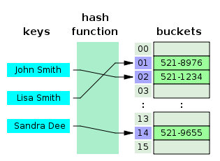

# Hash-table (Хэш-таблица)

## Информация

> Принцип работы хэш-таблицы и хэш-функции

::: tip Хэш-таблица

- **Хэш-таблица** - похожая на Map структура, , реализующая интерфейс ассоциативного массива и позволяющая хранить пары ключ/значение
- Это похоже на массив, только вместо использются hash-коды, которые создаются самостоятельно или использовать уже готовые hash-функции
- Она использует хэш-функцию для вычисления индекса в массиве из блоков данных, чтобы найти желаемое значение
- Обычно хэш-функция принимает строку символов в качестве вводных данных и выводит числовое значение. Для одного и того же ввода хэш-функция должна возвращать одинаковое число. Если два разных ввода хэшируются с одним и тем же итогом, возникает коллизия. Цель в том, чтобы таких случаев было как можно меньше
- Таким образом, когда вы вводите пару ключ/значение в хэш-таблицу, ключ проходит через хэш-функцию и превращается в число. В дальнейшем это число используется как фактический ключ, который соответствует определенному значению. Когда вы снова введёте тот же ключ, хэш-функция обработает его и вернет такой же числовой результат. Затем этот результат будет использован для поиска связанного значения
- _Назначение_: сокращение среднего времени поиска
  :::

---

## Операции

- Добавление новой пары
- Поиск
- Удаление пары по ключу

## Сложность алгоритма

| Алгоритм | Среднее значение | Худший случай |
| -------- | ---------------: | ------------: |
| Space    |             O(n) |          O(n) |
| Search   |             O(1) |          O(n) |
| Insert   |             O(1) |          O(n) |
| Delete   |             O(1) |          O(n) |
