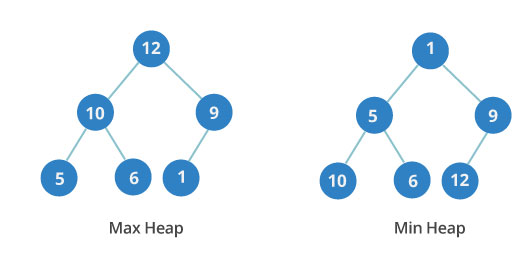

# Heap (Куча)

## Информация

::: tip Куча

- **Куча** - специализированная структура данных типа дерево, которая удовлетворяет свойству кучи: если B является узлом-потомком узла A, то ключ(A) ≥ ключ(B). Из этого следует, что элемент с наибольшим ключом всегда является корневым узлом кучи, поэтому иногда такие кучи называют max-кучами (в качестве альтернативы, если сравнение перевернуть, то наименьший элемент будет всегда корневым узлом, такие кучи называют min-кучами)
- _Реализация_: массив
  :::

## Операции

- Найти максимум или найти минимум: найти максимальный элемент в max-куче или минимальный элемент в min-куче, соответственно
- Удалить максимум или удалить минимум: удалить корневой узел в max- или min-куче, соответственно
- Увеличить ключ или уменьшить ключ: обновить ключ в max- или min-куче, соответственно
- Добавить: добавление нового ключа в кучу
- Слияние: соединение двух куч с целью создания новой кучи, содержащей все элементы обеих исходных

## Двоичная куча

::: tip Двоичная куча

- **Двоичная куча** - ещё одна древовидная структура данных. В ней у каждого узла не более двух потомков. Также она является совершенным деревом: это значит, что в ней полностью заняты данными все уровни, а последний заполнен слева направо
- _Порядок уровней в двоичной куче важен_, в отличие от порядка узлов на одном и том же уровне. На иллюстрации видно, что в минимальной куче на третьем уровне значения идут не по порядку: 10, 6 и 12

:::

### Разновидности

- Минимальная - ключ любого узла меньше ключей его потомков или равен им
- Максимальная - ключ любого узла всегда больше ключей его потомков или равен им

## Сложность алгоритма

| Алгоритм | Среднее значение | Худший случай |
| -------- | ---------------: | ------------: |
| Space    |             O(n) |          O(n) |
| Search   |             O(n) |          O(n) |
| Insert   |             O(1) |      O(log n) |
| Delete   |         O(log n) |      O(log n) |
| Peek     |             O(1) |          O(1) |
