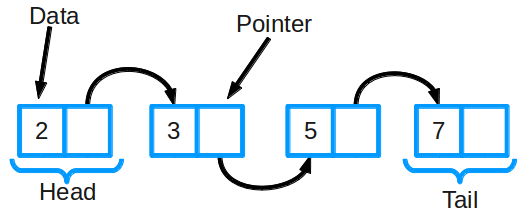

# Linked List (Связанный список)

## Информация

::: tip Связный список

- **Связный список** - состоит из группы узлов, которые вместе образуют последовательность. Каждый узел содержит: _фактические данные_, которые в нем хранятся (это могут быть данные любого типа) и _указатель_ (или ссылку) на следующий узел в последовательности
- Cyществуют **двусвязные списки**: в них у каждого узла есть указатель и на следующий, и на предыдущий элемент в списке
- Связанные списки хранят последовательность
- _Назначение_: Манипуляция данными
- В JavaScript массивы динамические, но есть языки, где массивы статичные (размер должен быть фиксированным во время комиляции и не может изменяться динамически). Для языков со статичными массивами примеяюися связанные списки

:::

## Плюсы и минусы

- [+] Быстрая вставка данных и их удаление
- [+] Размер списка не должен быть фиксированным при компиляции, он может меняться динамически во время выполнения
- [-] Занимает больше памяти, т.к. помимо данных хранится 1 или 2 указателя
- [-] Долгий поиск элементов

## Операции

- Добавление элемента
- Удаление элемента
- Поиск элемента в списке

## Применение

- Последовательности
- Для построения других структур данных (н-р: очередь)

## Сложность алгоритма

**Временная сложность связного списка**

| Алгоритм | Среднее значение | Худший случай |
| -------- | ---------------- | ------------- |
| Space    | O(n)             | O(n)          |
| Search   | O(n)             | O(n)          |
| Insert   | O(1)             | O(1)          |
| Delete   | O(1)             | O(1)          |
