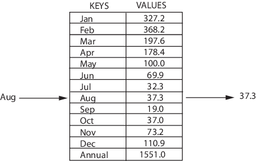

# Map

## Информация

::: tip Map 

- **Map** - структура, которая хранит данные в парах ключ/значение, где каждый ключ уникален
- Иногда её также называют ассоциативным массивом или словарём
- _Назначение_: быстрый поиск данных
  :::

## Операции

- Добавлять пары в коллекцию
- Удалять пары из коллекции
- Изменять существующии пары
- Искать значение, связанное с определенным ключом
