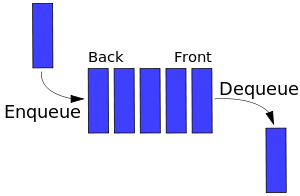

# Queue (Очередь)

## Информация

::: tip Queue

- **Queue (Очередь)** - абстрактный тип данных с доступом к элементам, организованный по принципу _FIFO_

- Добавление элемента (_enqueue_ — поставить в очередь) возможно лишь в конец очереди, выборка - только из начала очереди (_dequeue_ - убрать из очереди), при этом выбранный элемент удаляется из очереди

- Можно представить как очередь в продуктовом магазине: первым обслуживают того, кто пришёл в самом начале
  :::

## Операции

- `enqueue` - добавлять элементы в конец очереди
- `dequeue` - удалять первый элемент из очереди

## Применение

1. Очереди
2. Очередь событий JavaScript

## Сложность алгоритма

::: tip Queue Priority Queue

- **Priority Queue** (Очередь с приоритетом) - аналогично очереди, но output зависит от реализации: мы зададим ключ или параметр, по которому будет вычисляться приоритет output. Н-р: есть очередь задачь. когда закончена одна задача, переходим к следующей самой приоритетной из других
  :::

**Временная сложность очереди**

| Алгоритм | Среднее значение | Худший случай |
| -------- | ---------------- | ------------- |
| Space    | O(n)             | O(n)          |
| Search   | O(n)             | O(n)          |
| Insert   | O(1)             | O(1)          |
| Delete   | O(1)             | O(1)          |
