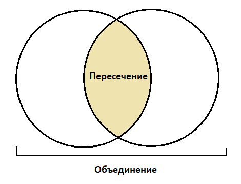

# Set (Множество)

## Информация

::: tip Множество

- **Множество** - хранит значения данных без определенного порядка, не повторяя их
  :::

## Операции над множеством

- Добавление элементов
- Удаление элементов

## Операции над двумя множествами

- _Объединение_ - комбинирует все элементы из двух разных множеств, превращая их в одно (без дубликатов)
- _Пересечение_ - анализирует два множества и создает еще одно из тех элементов, которые присутствуют в обоих изначальных множествах
- _Разность_ - выводит список элементов, которые есть в одном множестве, но отсутствуют в другом
- _Подмножество_ - выдает булево значение, которое показывает, включает ли одно множество все элементы другого множества
