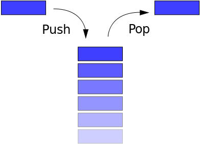
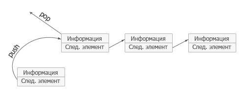
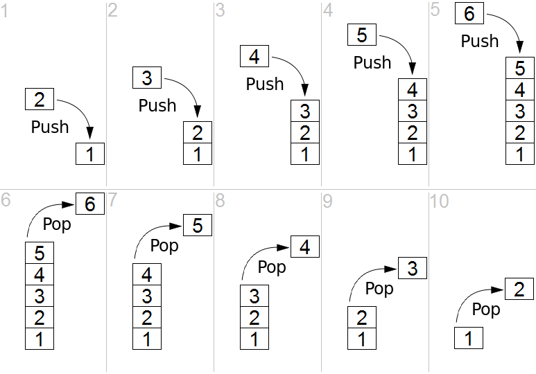

# Stack (Стек)

## Информация

::: tip Стек 

- **Стек** - абстрактный тип данных, представляющий собой список элементов, организованных по принципу _LIFO_ (позволяет добавлять или удалять элементы только в начале). Он похожа на стопку книг: если вы хотите взглянуть на книгу в середине стека, сперва придется убрать лежащие сверху
- _У каждого элемента есть ссылка на предыдущий элемент_
- Зачастую стек реализуется в виде однонаправленного списка (каждый элемент в списке содержит помимо хранимой информации в стеке указатель на следующий элемент стека). Но также часто стек располагается в одномерном массиве с упорядоченными адресами
  :::

## Операции

- `push` - *Добавление элемента*. Добавляется новый элемент, указывающий на элемент, бывший до этого головой. Новый элемент теперь становится головным
- `pop` - *Удаление элемента*. Убирается первый, а головным становится тот, на который был указатель у этого объекта (следующий элемент). При этом значение убранного элемента возвращается
- `peek` - _Чтение головного элемента_
- `pip` - _Отображение содержимого стека_

- Организация стека в виде одномерного упорядоченного по адресам массива. push и pop

## Применение

1. Парсеры (`
Hello
`)
2. Транспиляторы (`{"({})"}`)
3. Стек вызовов функций JavaScript
4. История изменений (н-р: ввели что-то, нажали Ctrl+Z и отбразилось предыдущее состояние)

## Сложность алгоритма

**Временная сложность стека**

| Алгоритм | Среднее значение | Худший случай |
| -------- | ---------------- | ------------- |
| Space    | O(n)             | O(n)          |
| Search   | O(n)             | O(n)          |
| Insert   | O(1)             | O(1)          |
| Delete   | O(1)             | O(1)          |
