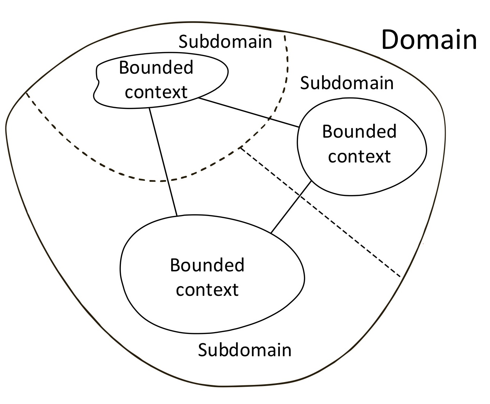
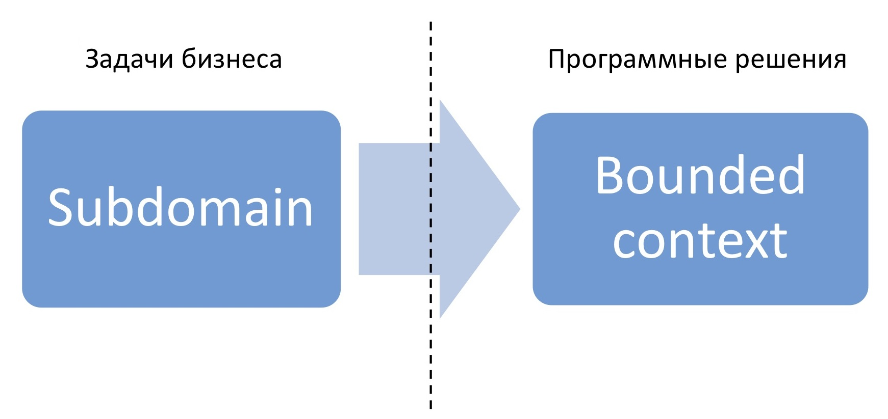

# Domain-Driven Design (DDD)

::: tip Domain-Driven Design

- **Domain-Driven Design (DDD)** (предметно-ориентированное проектирование) - набор принципов и схем, направленных на создание оптимальных систем объектов. Сводится к созданию программных абстракций, которые называются моделями предметных областей. В эти модели входит бизнес-логика, устанавливающая связь между реальными условиями области применения продукта и кодом
- DDD - набор правил, которые позволяют принимать правильные проектные решения. Данный подход позволяет значительно ускорить процесс проектирования программного обеспечения в незнакомой предметной области
- DDD - набор подходов для организации кода в системах со сложной предметной областью
- Подход DDD особо полезен в ситуациях, когда разработчик не является специалистом в области разрабатываемого продукта. К примеру: программист не может знать все области, в которых требуется создать ПО, но с помощью правильного представления структуры, посредством проблемно-ориентированного подхода, может без труда спроектировать приложение, основываясь на ключевых моментах и знаниях рабочей области
- Приложение должно максимально рассказыать какую предметную область решаем
  :::

## Применение

- Проекты с тяжелой бизнес-логикой
- Проекты, которые сложно разграничить

## Структура

### Определения

- **Domain** (Область) - сущность или действия реального мира, которые пытаемся автоматизировать. Предметная область, к которой применяется разрабатываемое ПО
- **Model** (Модель) - описывает отдельные аспекты области и может быть использована для решения проблемы
- **Ubiquitous Language** (Единый язык домена) - набор терминов, применяемых в модели домена для объяснения связей и дейтствий. Используется для единого стиля описания домена и модели. Необходим для постоения правильного взаимодействия между доменными специалистами (бизнес-аналитиками, аналитиками, PM, заказчиком) и разработчиками, чтобы могли общаться на одном языке
- **Bounded Context** - контекст, ограничивающий Domain Model и Ubiquitous Language

<v-two>
  <template #first>
    
  </template>

<template #last>

</template>
</v-two>

### Алгоритм

- Есть домен, котрый является определенной бизнес-задачей
- Далее идёт разбиение на поддомены - те действующий элементы проекта, который составляют основной функционал

### Поддомены

1. **Core Domain** (Ядро домена) - основной бизнес-процесс. Основная задача DDD - вычленить его
2. **Supporting Domain** - от них зависит бизнес, но которые не имеют прямого отношения к ядру. Что-то помогающее бизнес-процессу

## Архитектурные решения

- **Model-Driven Design** - проектирование от модели
- **CQRS** - архитектурный подход. Разделение представления данных как со сторный БД, так и внутри самого приложения

## Шаблоны проектирования, часто используемые с DDD

::: details 1. Entity

- Описывает индивидуально существующие элементы домена
- Определяется по идентификатору, а не по значению атрибутов
- Непрерывно и однозначно определяется на всем протяжении существования

:::

::: details 2. Value Object

- Не обладается идентификатором
- Описывает элементы домена, полностью определяемые свойствами
- Неизменяемый после создания
- Используется для типизации и структурирования данных
  :::

::: details 3. Aggregate

- Собирательная сущность, которая считаетмя единым целым
- Состоит из Value Object и Entity
- Определяется по идентификатору
- Является границей транзакции при изменении данных
- Другие элементы домена не могут ссылаться на внтренности агрегата
  :::

::: details 4. Respository

- Описывается интерфейсом
- Объекты не зависят от структуры БД и типов полей
- В рамках доменного слоя реализация не важна
- Может быть реализован для разных хранилищ
- Удобно тестировать
- Хорошо ложится в DDD
- Сложно со старта
- Входной порог существенно выше
- Придётся писать гидраторы
  :::

::: details 5. Service

:::
