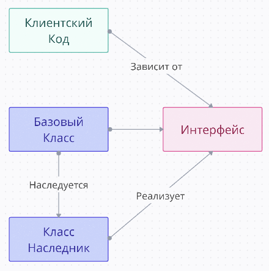
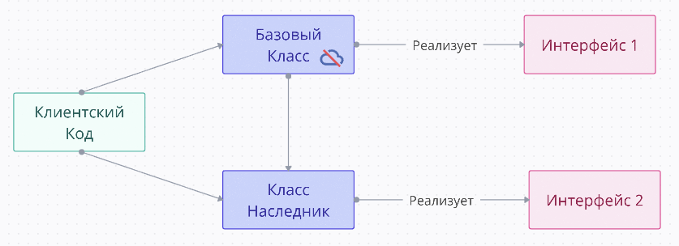

# 2. The Open Closed Principle

## Информация

::: tip Определение

- **The Open Closed Principle** - Принцип открытости/закрытости
- Программные сущности (классы, модули, функции и т.д.) должны быть открыты для расширения, но закрыты для модификации
- Любой блок должен быть открыт для добавления новой функциональности. Новая функциональность не должна изменять существующую

  :::

- Небольшое изменение класса не должно затрагивать связанные с ним модули
- От класса можно наследоваться и расширить его функциональность, но нет прямой возможности менять функциональность базового класса
- Неважно сколько добавили свойств объекту, код будет работать

### Результат применения

- _Разработка устойчивого к изменениям приложения_: при добавлении нового поведения у программной сущности обеспечиваем корректную работу существующего кода, который взаимодействует с этой сущностью
- Сделать поведение класса более разнообразным, не вмешиваясь в текущие операции, которые он выполняет. Благодаря этому вы избегаете ошибок в тех фрагментах кода, где задействован этот класс

### Принцип помогает

- Проектировать модули, выполняющие только одну задачу
- Вводит абстракцию, через которую связываются сущности
- Позволяет расширять имплементацию и расширяет ее от изменений
- Выносит место взаимодействия модулей в отдельную прозрачную сущность

### Две трактовки

**1. От Боба Мартина. Полиморфный (приоритетная трактовка)**

- _КлиентскийКод_ должен зависеть от интерфейса, который неизменный (_КлиентскийКод_ не нужно переписывать)
- _БазовыйКласс_ и _КлассНаследник_ реализует одинаковый неизменный интерфейс



**2. От Бертрана Мейера**

- После разработки БазовогоКласса, он полностью закрывается для изменений. Исключение только для bugfix
- Добавление новой функциональность происходит с помощью наследования. Новая функциональность добавляеся в _КлассНаследник_
- _КлассНаследник_ может иметь другой интерфейс. При этом, если КлиентскийКод до этого вызывал БазовыйКласс, а сейчас вызывает _КлассНаследник_ с другим интерфейсом, то придется переписывать КлиентскийКод



## Примеры

> Примеры аналогичны _Liskóv Substitution Principle_. Можно рассмотреть пример на Shape

::: warning

- Пример не проверен
  :::

<v-two compare :title="['Хорошо', 'Плохо']">
  <template #first>

```js{8-10,19-22}
class Vehicle {
  constructor(fuelCapacity, fuelEfficiency) {
    this.fuelCapacity = fuelCapacity;
    this.fuelEfficiency = fuelEfficiency;
  }
  getMaxDistance() {
    let distance = this.fuelCapacity * this.fuelEfficiency;
    if (this instanceof HybridVehicle) {
      distance += this.electricRange;
    }
    return distance;
  }
}

class HybridVehicle extends Vehicle {
  constructor(fuelCapacity, fuelEfficiency, electricRange) {
    super(fuelCapacity, fuelEfficiency);
    this.electricRange = electricRange;
  }
  getMaxDistance() {
    return this.fuelCapacity * this.fuelEfficiency + this.electricRange;
  }
}
```

  </template>
  <template #last>

```js
class Vehicle {
  constructor(fuelCapacity, fuelEfficiency) {
    this.fuelCapacity = fuelCapacity;
    this.fuelEfficiency = fuelEfficiency;
  }
  getMaxDistance() {
    return this.fuelCapacity * this.fuelEfficiency;
  }
}

class HybridVehicle extends Vehicle {
  constructor(fuelCapacity, fuelEfficiency, electricRange) {
    super(fuelCapacity, fuelEfficiency);
    this.electricRange = electricRange;
  }
}
```

  </template>
</v-two>

---

## Применение в React

::: details Пример с кнопкой

- На примере выше мы имеем абстрактную базовую кнопку, которую мы не можем изменять, но можем расширять, за счет передачи таких значений как className, onClick и children

```js
const Button = ({ onClick, children, className = "" }) => {
  return (
    <button className={`base-button ${className}`} onClick={onClick}>
      {children}
    </button>
  );
};

const PrimaryButton = ({ onClick, children }) => {
  return (
    <Button onClick={onClick} className="primary-button">
      {children}
    </Button>
  );
};

const IconButton = ({ onClick, icon, children }) => {
  return (
    <Button onClick={onClick} className="icon-button">
      <span className="icon">{icon}</span>
      {children}
    </Button>
  );
};
```

:::

::: details Пример с HOC

```js
// Базовый компонент Button
const Button = ({ children, onClick, ...props }) => {
  return (
    <button onClick={onClick} {...props}>
      {children}
    </button>
  );
};

// Higher-Order Component для добавления логирования
const withLogging = (WrappedComponent) => {
  return function LoggingComponent(props) {
    const handleClick = () => {
      console.log(`Button clicked: ${props.children}`);

      if (props.onClick) {
        props.onClick();
      }
    };

    return <WrappedComponent {...props} onClick={handleClick} />;
  };
};

// Создание компонента с логированием
const LoggingButton = withLogging(Button);
```

:::
